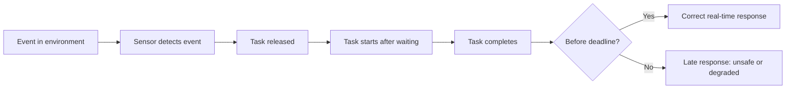
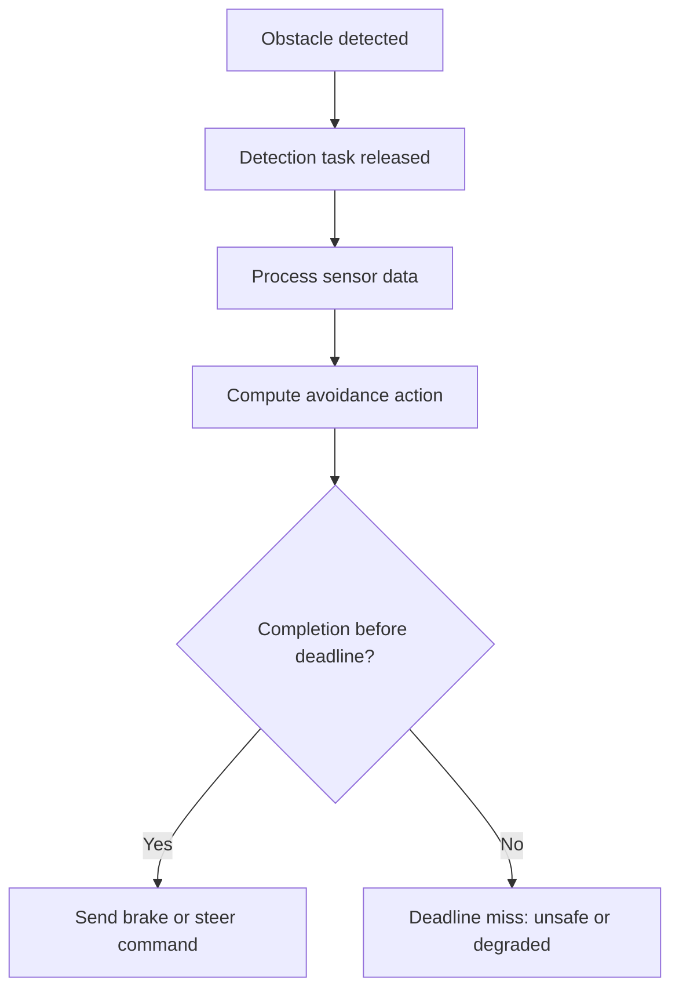
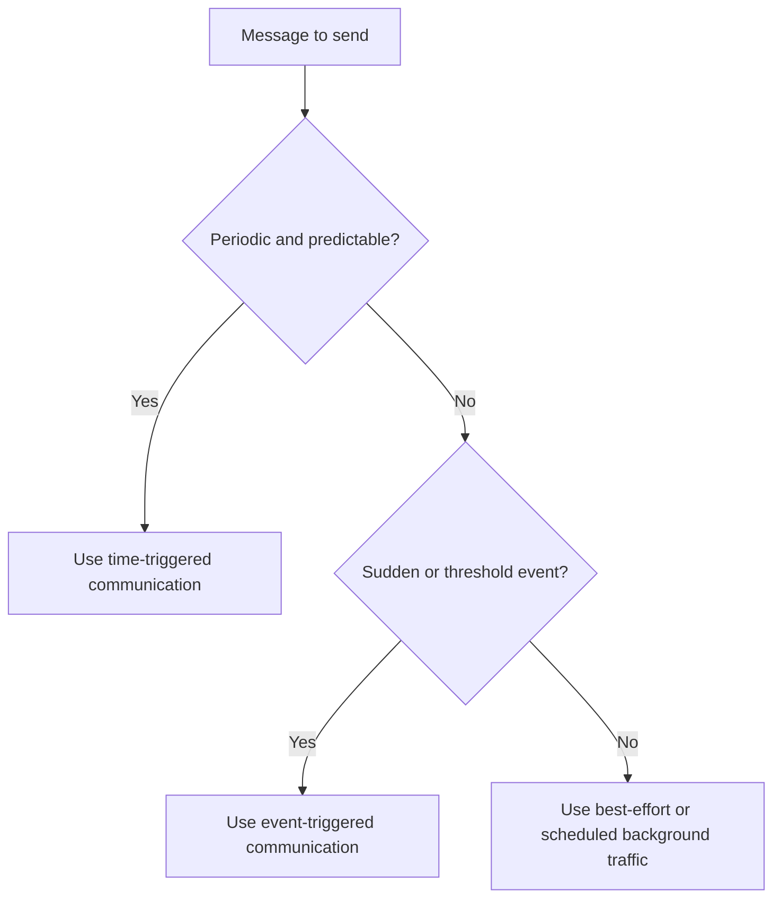
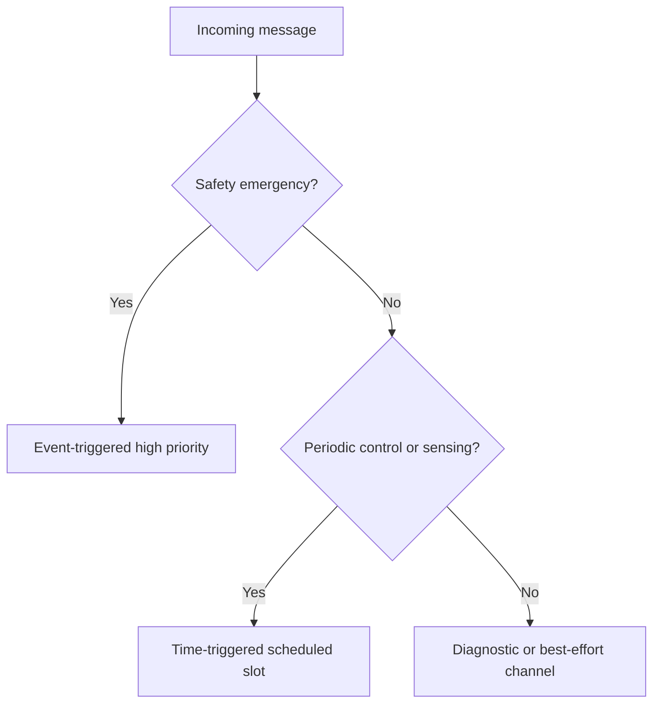

# CO1 and CO2 Solved Notes

Source PDF: `d:\work\E02\Real-Time Networks Communication and Security for Autonomous Systems\cc meetings\CO1_CO2_All_Questions.pdf`

Prepared as notebook-style text answers. Repeated questions in the PDF are consolidated, but every distinct question pattern from CO1 and CO2 is covered.

<!-- BEGIN COMPLETE PDF QUESTION ANSWER INDEX -->

## Complete PDF Question-Answer Index

Each question below is copied from the source PDF and followed by a direct answer. Detailed explanations, diagrams, block diagrams, flowcharts, case studies, and worked methods continue in the later notebook sections.

**Question:** Explain why the correctness of a real-time system depends on both the computational result and its completion time.

**Answer:**

Correctness depends on both logical output and time of completion. A correct value produced after the deadline is still a real-time failure, such as a braking command calculated after the collision window.

---

**Question:** Classify an automobile airbag controller and an online video-streaming system as hard or soft real-time systems.

**Answer:**

An automobile airbag controller is hard real-time because a missed deadline can cause injury. Online video streaming is soft real-time because delay mainly reduces quality.

---

**Question:** Show the communication latency when a sensor packet is transmitted at 12.4 ms and received at 17.9 ms.

**Answer:**

**Definition:** Latency is the one-way communication delay between the time a packet is transmitted and the time it is received.

**Formula:**

```text
Latency = receive time - transmit time
```

**Given data:**

```text
Transmit time = 12.4 ms
Receive time = 17.9 ms
```

**Calculation:**

```text
Latency = 17.9 - 12.4
Latency = 5.5 ms
```

**Block diagram:**

```text
[Sensor node] -- packet transmitted at 12.4 ms --> [Network] -- received at 17.9 ms --> [Controller]
                                      <----------- latency = 5.5 ms ----------->
```

**Interpretation:** The packet takes **5.5 ms** to travel from the sensor to the controller. Lower latency gives the autonomous controller more time to decide and actuate before its deadline.

---

**Question:** Compare hard and soft real-time systems based on deadline strictness, consequences of deadline misses, predictability and applications.

**Answer:**

Hard real-time systems have strict deadlines and deadline misses can invalidate the result or cause unsafe operation. Soft real-time systems tolerate occasional deadline misses with degraded quality. Hard systems require stronger predictability and analyzable scheduling.

---

**Question:** Demonstrate throughput and jitter when four packets of 1,000 bytes are transmitted in 20 ms with latencies of 4 ms, 5 ms, 7 ms and 6 ms, considering jitter as the difference between maximum and minimum latency.

**Answer:**

**Definitions:**

- Throughput is the transmitted data rate in bits per second.
- Jitter is the variation in packet latency. Here, jitter = maximum latency - minimum latency.

**Block diagram:**

```text
[Sender] -- four 1,000-byte packets in 20 ms --> [Network] --> [Receiver]
                 packet delays: 4 ms, 5 ms, 7 ms, 6 ms
```

**Given data:**

```text
Number of packets = 4
Packet size = 1,000 bytes
Latencies = 4 ms, 5 ms, 7 ms, 6 ms
Transmission time = 20 ms = 0.020 s
```

**Data conversion:**

```text
Total bytes = 4 x 1,000 = 4,000 bytes
Total bits = 4,000 x 8 = 32,000 bits
```

**Throughput calculation:**

```text
Throughput = total bits / total time
Throughput = 32,000 / 0.020
Throughput = 1,600,000 bit/s
Throughput = 1.6 Mbps
```

**Jitter calculation:**

```text
Jitter = maximum latency - minimum latency
Jitter = 7 - 4
Jitter = 3 ms
```

**Final answer:** throughput = **1.6 Mbps**, jitter = **3 ms**.

**Interpretation:** The network can deliver 1.6 megabits per second for this sample. The delay variation is 3 ms, so packet timing is not perfectly uniform.

---

**Question:** Explain the characteristics of autonomous systems that create a need for predictable real-time communication.

**Answer:**

They perform continuous sensing, closed-loop control, distributed coordination, and safety-critical actuation. Because the physical environment changes quickly, communication must be low-latency, low-jitter, reliable, and deadline-compliant. Example: a warehouse robot must receive obstacle data before it reaches the obstacle.

---

**Question:** Demonstrate the waiting time, execution time, response time and deadline margin when a braking task is released at 2 ms, starts at 5 ms, completes at 11 ms and has an absolute deadline of 15 ms.

**Answer:**

**Definitions:**

- Waiting time is the time a released task waits before execution starts.
- Execution time is the time spent running on the processor.
- Response time is the total time from release to completion.
- Deadline margin is the remaining time between completion and the absolute deadline.

**Block diagram:**

```text
time ---->

Release       Start       Completion       Deadline
  |             |              |               |
  v             v              v               v
--+-------------+--------------+---------------+--
  <--- wait ---><-- execute -->
  <-------- response --------->
                                <--- margin --->
```

**Given data for the braking task:**

```text
Release time = 2 ms
Start time = 5 ms
Completion time = 11 ms
Absolute deadline = 15 ms
```

**Calculations:**

```text
Waiting time = start - release = 5 - 2 = 3 ms
Execution time = completion - start = 11 - 5 = 6 ms
Response time = completion - release = 11 - 2 = 9 ms
Deadline margin = deadline - completion = 15 - 11 = 4 ms
```

**Final answer:** waiting time = **3 ms**, execution time = **6 ms**, response time = **9 ms**, deadline margin = **4 ms**.

**Interpretation:** The task **meets** the deadline because it completes 4 ms before the deadline.

---

**Question:** Outline the communication requirements of an autonomous warehouse robot with respect to latency, jitter, throughput, reliability and deadline compliance.

**Answer:**

It needs low latency for fast reaction, low jitter for stable control, enough throughput for sensor and status data, high reliability to avoid missing hazards, and deadline compliance for safety commands.

---

**Question:** Show the average latency, jitter and throughput when packet latencies are 4 ms, 6 ms, 5 ms and 7 ms, and 40,000 bits are transmitted in 10 ms.

**Answer:**

**Definitions:**

- Average latency is the mean packet delay.
- Jitter is the variation in packet delay. Here, jitter = maximum latency - minimum latency.
- Throughput is the amount of data successfully transmitted per second.

**Block diagram:**

```text
[Sender] -> [Network path with variable delay] -> [Receiver]
              |
              +-- observed packet latencies: 4 ms, 6 ms, 5 ms, 7 ms
```

**Given data:**

```text
Latencies = 4 ms, 6 ms, 5 ms, 7 ms
Total data = 40,000 bits
Transmission time = 0.01 s
```

**Average latency calculation:**

```text
Average latency = (4 + 6 + 5 + 7) / 4
Average latency = 22 / 4
Average latency = 5.5 ms
```

**Jitter calculation:**

```text
Jitter = maximum latency - minimum latency
Jitter = 7 - 4
Jitter = 3 ms
```

**Throughput calculation:**

```text
Throughput = total bits / total time
Throughput = 40,000 / 0.01
Throughput = 4,000,000 bit/s
Throughput = 4 Mbps
```

**Final answer:** average latency = **5.5 ms**, jitter = **3 ms**, throughput = **4 Mbps**.
**Interpretation:** Lower average latency improves reaction speed. Lower jitter improves predictability because packets arrive at more regular intervals.

---

**Question:** Explain the meaning of a timing constraint in an autonomous real-time system.

**Answer:**

A timing constraint specifies when a task or message must complete. In autonomous systems, data and commands lose value after the deadline because the physical state may already have changed.

---

**Question:** Relate response time and deadline in an emergency obstacle-detection system.

**Answer:**

Response time is completion time minus release time. A task is acceptable only if response time is within the allowed relative deadline, or equivalently if completion time is not later than the absolute deadline.

---

**Question:** Demonstrate jitter for packet latencies of 6 ms, 8 ms, 7 ms and 9 ms, considering jitter as the difference between maximum and minimum latency.

**Answer:**

**Definitions:**

- Average latency is the mean packet delay.
- Jitter is the variation in packet delay. Here, jitter = maximum latency - minimum latency.
- Throughput is the amount of data successfully transmitted per second.

**Block diagram:**

```text
[Sender] -> [Network path with variable delay] -> [Receiver]
              |
              +-- observed packet latencies: 6 ms, 8 ms, 7 ms, 9 ms
```

**Given data:**

```text
Latencies = 6 ms, 8 ms, 7 ms, 9 ms
```

**Average latency calculation:**

```text
Average latency = (6 + 8 + 7 + 9) / 4
Average latency = 30 / 4
Average latency = 7.5 ms
```

**Jitter calculation:**

```text
Jitter = maximum latency - minimum latency
Jitter = 9 - 6
Jitter = 3 ms
```

**Final answer:** average latency = **7.5 ms**, jitter = **3 ms**.
**Interpretation:** Lower average latency improves reaction speed. Lower jitter improves predictability because packets arrive at more regular intervals.

---

**Question:** Outline the characteristics of autonomous systems that require low-latency and reliable communication.

**Answer:**

They perform continuous sensing, closed-loop control, distributed coordination, and safety-critical actuation. Because the physical environment changes quickly, communication must be low-latency, low-jitter, reliable, and deadline-compliant. Example: a warehouse robot must receive obstacle data before it reaches the obstacle.

---

**Question:** Interpret the throughput of a network that transmits 120 packets of 1,000 bytes each in 0.4 seconds.

**Answer:**

**Definition:** Throughput is the amount of data transmitted successfully per unit time.

**Block diagram:**

```text
[Sender] -- 120 packets, 1,000 bytes each, over 0.4 s --> [Receiver]
```

**Given data:**

```text
Packets = 120
Packet size = 1,000 bytes
Transmission time = 0.4 s
```

**Data conversion:**

```text
Total bytes = 120 x 1,000 = 120,000 bytes
Total bits = 120,000 x 8 = 960,000 bits
```

**Calculation:**

```text
Throughput = total bits / total time
Throughput = 960,000 / 0.4
Throughput = 2,400,000 bit/s
Throughput = 2.4 Mbps
```

**Final answer:** throughput = **2.4 Mbps**.

**Interpretation:** This network sample carries 2.4 megabits per second.

---

**Question:** Explain the relationship among event occurrence time, release time, start time, completion time and deadline.

**Answer:**

Event occurrence is when the physical event happens; release time is when the software task becomes ready; start time is when execution begins; completion time is when it finishes; deadline is the latest allowed completion time.

---

**Question:** Demonstrate the waiting time, execution time, response time and deadline margin when a drone-control task is released at 10 ms, starts at 13 ms, completes at 20 ms and has an absolute deadline of 24 ms.

**Answer:**

**Definitions:**

- Waiting time is the time a released task waits before execution starts.
- Execution time is the time spent running on the processor.
- Response time is the total time from release to completion.
- Deadline margin is the remaining time between completion and the absolute deadline.

**Block diagram:**

```text
time ---->

Release       Start       Completion       Deadline
  |             |              |               |
  v             v              v               v
--+-------------+--------------+---------------+--
  <--- wait ---><-- execute -->
  <-------- response --------->
                                <--- margin --->
```

**Given data for the drone-control task:**

```text
Release time = 10 ms
Start time = 13 ms
Completion time = 20 ms
Absolute deadline = 24 ms
```

**Calculations:**

```text
Waiting time = start - release = 13 - 10 = 3 ms
Execution time = completion - start = 20 - 13 = 7 ms
Response time = completion - release = 20 - 10 = 10 ms
Deadline margin = deadline - completion = 24 - 20 = 4 ms
```

**Final answer:** waiting time = **3 ms**, execution time = **7 ms**, response time = **10 ms**, deadline margin = **4 ms**.

**Interpretation:** The task **meets** the deadline because it completes 4 ms before the deadline.

---

**Question:** Compare latency, jitter and throughput based on their meaning, measurement unit and effect on autonomous communication.

**Answer:**

Latency is packet delay, measured in time units. Jitter is variation in packet delay, also measured in time units. Throughput is delivered data rate, measured in bit/s. High latency delays decisions, high jitter makes timing unpredictable, and low throughput restricts sensor/video data.

---

**Question:** Show the average latency, jitter and throughput when packet latencies are 3 ms, 5 ms, 4 ms and 6 ms, and 48,000 bits are transmitted in 12 ms.

**Answer:**

**Definitions:**

- Average latency is the mean packet delay.
- Jitter is the variation in packet delay. Here, jitter = maximum latency - minimum latency.
- Throughput is the amount of data successfully transmitted per second.

**Block diagram:**

```text
[Sender] -> [Network path with variable delay] -> [Receiver]
              |
              +-- observed packet latencies: 3 ms, 5 ms, 4 ms, 6 ms
```

**Given data:**

```text
Latencies = 3 ms, 5 ms, 4 ms, 6 ms
Total data = 48,000 bits
Transmission time = 0.012 s
```

**Average latency calculation:**

```text
Average latency = (3 + 5 + 4 + 6) / 4
Average latency = 18 / 4
Average latency = 4.5 ms
```

**Jitter calculation:**

```text
Jitter = maximum latency - minimum latency
Jitter = 6 - 3
Jitter = 3 ms
```

**Throughput calculation:**

```text
Throughput = total bits / total time
Throughput = 48,000 / 0.012
Throughput = 4,000,000 bit/s
Throughput = 4 Mbps
```

**Final answer:** average latency = **4.5 ms**, jitter = **3 ms**, throughput = **4 Mbps**.
**Interpretation:** Lower average latency improves reaction speed. Lower jitter improves predictability because packets arrive at more regular intervals.

---

**Question:** Summarize the purpose of real-time communication in an autonomous system.

**Answer:**

Its purpose is to deliver sensor data, coordination data, and actuator commands within known time limits so an autonomous system can perceive, decide, and act before deadlines expire.

---

**Question:** Contrast latency and jitter in packet-based communication.

**Answer:**

Latency is the delay of one packet or message. Jitter is the variation among packet delays. A system may have low average latency but still poor predictability if jitter is high.

---

**Question:** Interpret the deadline behaviour of a task that finishes at 18 ms when its absolute deadline is 15 ms.

**Answer:**

**Definition:** Deadline margin shows whether a task finishes before or after its absolute deadline.

**Formula:**

```text
Deadline margin = absolute deadline - completion time
```

**Block diagram:**

```text
time ---->
Deadline at 15 ms        Completion at 18 ms
      |                         |
------+-------------------------+--
      <------ task is late by 3 ms ------>
```

**Calculation:**

```text
Deadline margin = 15 - 18
Deadline margin = -3 ms
```

**Final answer:** The task misses its deadline by **3 ms**.

**Interpretation:** For a hard real-time task, this is a timing failure. For a soft real-time task, the result may still be usable but with reduced value.

---

**Question:** Classify emergency braking, path planning, infotainment streaming and periodic data logging as hard or soft real-time activities.

**Answer:**

Emergency braking is hard real-time. Path planning, infotainment streaming, and periodic data logging are generally soft real-time unless they are directly tied to an immediate safety actuator.

---

**Question:** Show the average latency and jitter for packet latencies of 4 ms, 6 ms, 5 ms and 5 ms, considering jitter as the difference between maximum and minimum latency.

**Answer:**

**Definitions:**

- Average latency is the mean packet delay.
- Jitter is the variation in packet delay. Here, jitter = maximum latency - minimum latency.
- Throughput is the amount of data successfully transmitted per second.

**Block diagram:**

```text
[Sender] -> [Network path with variable delay] -> [Receiver]
              |
              +-- observed packet latencies: 4 ms, 6 ms, 5 ms, 5 ms
```

**Given data:**

```text
Latencies = 4 ms, 6 ms, 5 ms, 5 ms
```

**Average latency calculation:**

```text
Average latency = (4 + 6 + 5 + 5) / 4
Average latency = 20 / 4
Average latency = 5 ms
```

**Jitter calculation:**

```text
Jitter = maximum latency - minimum latency
Jitter = 6 - 4
Jitter = 2 ms
```

**Final answer:** average latency = **5 ms**, jitter = **2 ms**.
**Interpretation:** Lower average latency improves reaction speed. Lower jitter improves predictability because packets arrive at more regular intervals.

---

**Question:** Compare hard and soft real-time systems based on deadline strictness, deadline-miss consequences, predictability, scheduling requirements and applications.

**Answer:**

Hard real-time systems have strict deadlines and deadline misses can invalidate the result or cause unsafe operation. Soft real-time systems tolerate occasional deadline misses with degraded quality. Hard systems require stronger predictability and analyzable scheduling.

---

**Question:** Demonstrate the waiting time, execution time, response time and deadline margin when an industrial robot task is released at 4 ms, starts at 7 ms, completes at 14 ms and has an absolute deadline of 18 ms.

**Answer:**

**Definitions:**

- Waiting time is the time a released task waits before execution starts.
- Execution time is the time spent running on the processor.
- Response time is the total time from release to completion.
- Deadline margin is the remaining time between completion and the absolute deadline.

**Block diagram:**

```text
time ---->

Release       Start       Completion       Deadline
  |             |              |               |
  v             v              v               v
--+-------------+--------------+---------------+--
  <--- wait ---><-- execute -->
  <-------- response --------->
                                <--- margin --->
```

**Given data for the industrial robot task:**

```text
Release time = 4 ms
Start time = 7 ms
Completion time = 14 ms
Absolute deadline = 18 ms
```

**Calculations:**

```text
Waiting time = start - release = 7 - 4 = 3 ms
Execution time = completion - start = 14 - 7 = 7 ms
Response time = completion - release = 14 - 4 = 10 ms
Deadline margin = deadline - completion = 18 - 14 = 4 ms
```

**Final answer:** waiting time = **3 ms**, execution time = **7 ms**, response time = **10 ms**, deadline margin = **4 ms**.

**Interpretation:** The task **meets** the deadline because it completes 4 ms before the deadline.

---

**Question:** Explain the characteristics of autonomous systems that require predictable real-time communication.

**Answer:**

They perform continuous sensing, closed-loop control, distributed coordination, and safety-critical actuation. Because the physical environment changes quickly, communication must be low-latency, low-jitter, reliable, and deadline-compliant. Example: a warehouse robot must receive obstacle data before it reaches the obstacle.

---

**Question:** Demonstrate the average latency, jitter and throughput when five packets have latencies of 5 ms, 7 ms, 6 ms, 8 ms and 4 ms, and 60,000 bits are transmitted in 15 ms.

**Answer:**

**Definitions:**

- Average latency is the mean packet delay.
- Jitter is the variation in packet delay. Here, jitter = maximum latency - minimum latency.
- Throughput is the amount of data successfully transmitted per second.

**Block diagram:**

```text
[Sender] -> [Network path with variable delay] -> [Receiver]
              |
              +-- observed packet latencies: 5 ms, 7 ms, 6 ms, 8 ms, 4 ms
```

**Given data:**

```text
Latencies = 5 ms, 7 ms, 6 ms, 8 ms, 4 ms
Total data = 60,000 bits
Transmission time = 0.015 s
```

**Average latency calculation:**

```text
Average latency = (5 + 7 + 6 + 8 + 4) / 5
Average latency = 30 / 5
Average latency = 6 ms
```

**Jitter calculation:**

```text
Jitter = maximum latency - minimum latency
Jitter = 8 - 4
Jitter = 4 ms
```

**Throughput calculation:**

```text
Throughput = total bits / total time
Throughput = 60,000 / 0.015
Throughput = 4,000,000 bit/s
Throughput = 4 Mbps
```

**Final answer:** average latency = **6 ms**, jitter = **4 ms**, throughput = **4 Mbps**.
**Interpretation:** Lower average latency improves reaction speed. Lower jitter improves predictability because packets arrive at more regular intervals.

---

**Question:** Interpret the deadline behaviour of a task that finishes at 18 ms when its absolute deadline is 15 ms.

**Answer:**

**Definition:** Deadline margin shows whether a task finishes before or after its absolute deadline.

**Formula:**

```text
Deadline margin = absolute deadline - completion time
```

**Block diagram:**

```text
time ---->
Deadline at 15 ms        Completion at 18 ms
      |                         |
------+-------------------------+--
      <------ task is late by 3 ms ------>
```

**Calculation:**

```text
Deadline margin = 15 - 18
Deadline margin = -3 ms
```

**Final answer:** The task misses its deadline by **3 ms**.

**Interpretation:** For a hard real-time task, this is a timing failure. For a soft real-time task, the result may still be usable but with reduced value.

---

**Question:** Rephrase the definition of a real-time system using an autonomous-braking example.

**Answer:**

A real-time system is one where correctness depends on what result is produced and when it is produced. In autonomous braking, detecting an obstacle and computing the correct brake force is useful only if the brake command reaches the actuator before the stopping deadline.

---

**Question:** Demonstrate throughput and jitter when four packets of 1,000 bytes are transmitted in 20 ms with latencies of 4 ms, 5 ms, 7 ms and 6 ms, considering jitter as the difference between maximum and minimum latency, and interpret whether the computed result satisfies the stated real-time requirement.

**Answer:**

**Definitions:**

- Throughput is the transmitted data rate in bits per second.
- Jitter is the variation in packet latency. Here, jitter = maximum latency - minimum latency.

**Block diagram:**

```text
[Sender] -- four 1,000-byte packets in 20 ms --> [Network] --> [Receiver]
                 packet delays: 4 ms, 5 ms, 7 ms, 6 ms
```

**Given data:**

```text
Number of packets = 4
Packet size = 1,000 bytes
Latencies = 4 ms, 5 ms, 7 ms, 6 ms
Transmission time = 20 ms = 0.020 s
```

**Data conversion:**

```text
Total bytes = 4 x 1,000 = 4,000 bytes
Total bits = 4,000 x 8 = 32,000 bits
```

**Throughput calculation:**

```text
Throughput = total bits / total time
Throughput = 32,000 / 0.020
Throughput = 1,600,000 bit/s
Throughput = 1.6 Mbps
```

**Jitter calculation:**

```text
Jitter = maximum latency - minimum latency
Jitter = 7 - 4
Jitter = 3 ms
```

**Final answer:** throughput = **1.6 Mbps**, jitter = **3 ms**.

**Interpretation:** The network can deliver 1.6 megabits per second for this sample. The delay variation is 3 ms, so packet timing is not perfectly uniform.

**Requirement check:** No numeric real-time requirement is given in the question, so satisfaction cannot be confirmed. It is satisfactory only if the required throughput is <= 1.6 Mbps and the allowed jitter is >= 3 ms.

---

**Question:** Explain the characteristics of autonomous systems that create a need for predictable real-time communication. Illustrate the answer with one suitable autonomous-system example.

**Answer:**

They perform continuous sensing, closed-loop control, distributed coordination, and safety-critical actuation. Because the physical environment changes quickly, communication must be low-latency, low-jitter, reliable, and deadline-compliant. Example: a warehouse robot must receive obstacle data before it reaches the obstacle.

---

**Question:** Show the average latency, jitter and throughput when packet latencies are 4 ms, 6 ms, 8 ms, 5 ms and 7 ms, and 70,000 bits are transmitted in 20 ms. Show all intermediate calculations and interpret the final result.

**Answer:**

**Definitions:**

- Average latency is the mean packet delay.
- Jitter is the variation in packet delay. Here, jitter = maximum latency - minimum latency.
- Throughput is the amount of data successfully transmitted per second.

**Block diagram:**

```text
[Sender] -> [Network path with variable delay] -> [Receiver]
              |
              +-- observed packet latencies: 4 ms, 6 ms, 8 ms, 5 ms, 7 ms
```

**Given data:**

```text
Latencies = 4 ms, 6 ms, 8 ms, 5 ms, 7 ms
Total data = 70,000 bits
Transmission time = 0.02 s
```

**Average latency calculation:**

```text
Average latency = (4 + 6 + 8 + 5 + 7) / 5
Average latency = 30 / 5
Average latency = 6 ms
```

**Jitter calculation:**

```text
Jitter = maximum latency - minimum latency
Jitter = 8 - 4
Jitter = 4 ms
```

**Throughput calculation:**

```text
Throughput = total bits / total time
Throughput = 70,000 / 0.02
Throughput = 3,500,000 bit/s
Throughput = 3.5 Mbps
```

**Final answer:** average latency = **6 ms**, jitter = **4 ms**, throughput = **3.5 Mbps**.
**Interpretation:** Lower average latency improves reaction speed. Lower jitter improves predictability because packets arrive at more regular intervals.

---

**Question:** Outline the communication requirements of an autonomous warehouse robot with respect to latency, jitter, throughput, reliability and deadline compliance. Illustrate the answer with one suitable autonomous-system example.

**Answer:**

It needs low latency for fast reaction, low jitter for stable control, enough throughput for sensor and status data, high reliability to avoid missing hazards, and deadline compliance for safety commands.

---

**Question:** Demonstrate the average latency, jitter and throughput when five packets have latencies of 5 ms, 7 ms, 6 ms, 8 ms and 4 ms, and 60,000 bits are transmitted in 15 ms. Show all intermediate calculations and interpret the final result.

**Answer:**

**Definitions:**

- Average latency is the mean packet delay.
- Jitter is the variation in packet delay. Here, jitter = maximum latency - minimum latency.
- Throughput is the amount of data successfully transmitted per second.

**Block diagram:**

```text
[Sender] -> [Network path with variable delay] -> [Receiver]
              |
              +-- observed packet latencies: 5 ms, 7 ms, 6 ms, 8 ms, 4 ms
```

**Given data:**

```text
Latencies = 5 ms, 7 ms, 6 ms, 8 ms, 4 ms
Total data = 60,000 bits
Transmission time = 0.015 s
```

**Average latency calculation:**

```text
Average latency = (5 + 7 + 6 + 8 + 4) / 5
Average latency = 30 / 5
Average latency = 6 ms
```

**Jitter calculation:**

```text
Jitter = maximum latency - minimum latency
Jitter = 8 - 4
Jitter = 4 ms
```

**Throughput calculation:**

```text
Throughput = total bits / total time
Throughput = 60,000 / 0.015
Throughput = 4,000,000 bit/s
Throughput = 4 Mbps
```

**Final answer:** average latency = **6 ms**, jitter = **4 ms**, throughput = **4 Mbps**.
**Interpretation:** Lower average latency improves reaction speed. Lower jitter improves predictability because packets arrive at more regular intervals.

---

**Question:** Explain why the correctness of a real-time system depends on both the computational result and its completion time.

**Answer:**

Correctness depends on both logical output and time of completion. A correct value produced after the deadline is still a real-time failure, such as a braking command calculated after the collision window.

---

**Question:** Relate response time and deadline in an emergency obstacle-detection system.

**Answer:**

Response time is completion time minus release time. A task is acceptable only if response time is within the allowed relative deadline, or equivalently if completion time is not later than the absolute deadline.

---

**Question:** Classify emergency braking, path planning, infotainment streaming and periodic data logging as hard or soft real-time activities, and illustrate the explanation with one suitable autonomous-system example.

**Answer:**

Emergency braking is hard real-time. Path planning, infotainment streaming, and periodic data logging are generally soft real-time unless they are directly tied to an immediate safety actuator.

---

**Question:** Explain the relationship among event occurrence time, release time, start time, completion time and deadline. Illustrate the answer with one suitable autonomous-system example.

**Answer:**

Event occurrence is when the physical event happens; release time is when the software task becomes ready; start time is when execution begins; completion time is when it finishes; deadline is the latest allowed completion time.

---

**Question:** Demonstrate the waiting time, execution time, response time and deadline margin when a drone-control task is released at 10 ms, starts at 13 ms, completes at 20 ms and has an absolute deadline of 24 ms. Show all intermediate calculations and interpret the final result.

**Answer:**

**Definitions:**

- Waiting time is the time a released task waits before execution starts.
- Execution time is the time spent running on the processor.
- Response time is the total time from release to completion.
- Deadline margin is the remaining time between completion and the absolute deadline.

**Block diagram:**

```text
time ---->

Release       Start       Completion       Deadline
  |             |              |               |
  v             v              v               v
--+-------------+--------------+---------------+--
  <--- wait ---><-- execute -->
  <-------- response --------->
                                <--- margin --->
```

**Given data for the drone-control task:**

```text
Release time = 10 ms
Start time = 13 ms
Completion time = 20 ms
Absolute deadline = 24 ms
```

**Calculations:**

```text
Waiting time = start - release = 13 - 10 = 3 ms
Execution time = completion - start = 20 - 13 = 7 ms
Response time = completion - release = 20 - 10 = 10 ms
Deadline margin = deadline - completion = 24 - 20 = 4 ms
```

**Final answer:** waiting time = **3 ms**, execution time = **7 ms**, response time = **10 ms**, deadline margin = **4 ms**.

**Interpretation:** The task **meets** the deadline because it completes 4 ms before the deadline.

---

**Question:** Compare latency, jitter and throughput based on their meaning, measurement unit and effect on autonomous communication. Illustrate the answer with one suitable autonomous-system example.

**Answer:**

Latency is packet delay, measured in time units. Jitter is variation in packet delay, also measured in time units. Throughput is delivered data rate, measured in bit/s. High latency delays decisions, high jitter makes timing unpredictable, and low throughput restricts sensor/video data.

---

**Question:** Demonstrate the waiting time, execution time, response time and deadline margin when an industrial robot task is released at 4 ms, starts at 7 ms, completes at 14 ms and has an absolute deadline of 18 ms. Show all intermediate calculations and interpret the final result.

**Answer:**

**Definitions:**

- Waiting time is the time a released task waits before execution starts.
- Execution time is the time spent running on the processor.
- Response time is the total time from release to completion.
- Deadline margin is the remaining time between completion and the absolute deadline.

**Block diagram:**

```text
time ---->

Release       Start       Completion       Deadline
  |             |              |               |
  v             v              v               v
--+-------------+--------------+---------------+--
  <--- wait ---><-- execute -->
  <-------- response --------->
                                <--- margin --->
```

**Given data for the industrial robot task:**

```text
Release time = 4 ms
Start time = 7 ms
Completion time = 14 ms
Absolute deadline = 18 ms
```

**Calculations:**

```text
Waiting time = start - release = 7 - 4 = 3 ms
Execution time = completion - start = 14 - 7 = 7 ms
Response time = completion - release = 14 - 4 = 10 ms
Deadline margin = deadline - completion = 18 - 14 = 4 ms
```

**Final answer:** waiting time = **3 ms**, execution time = **7 ms**, response time = **10 ms**, deadline margin = **4 ms**.

**Interpretation:** The task **meets** the deadline because it completes 4 ms before the deadline.

---

**Question:** Demonstrate jitter for packet latencies of 6 ms, 8 ms, 7 ms and 9 ms, considering jitter as the difference between maximum and minimum latency.

**Answer:**

**Definitions:**

- Average latency is the mean packet delay.
- Jitter is the variation in packet delay. Here, jitter = maximum latency - minimum latency.
- Throughput is the amount of data successfully transmitted per second.

**Block diagram:**

```text
[Sender] -> [Network path with variable delay] -> [Receiver]
              |
              +-- observed packet latencies: 6 ms, 8 ms, 7 ms, 9 ms
```

**Given data:**

```text
Latencies = 6 ms, 8 ms, 7 ms, 9 ms
```

**Average latency calculation:**

```text
Average latency = (6 + 8 + 7 + 9) / 4
Average latency = 30 / 4
Average latency = 7.5 ms
```

**Jitter calculation:**

```text
Jitter = maximum latency - minimum latency
Jitter = 9 - 6
Jitter = 3 ms
```

**Final answer:** average latency = **7.5 ms**, jitter = **3 ms**.
**Interpretation:** Lower average latency improves reaction speed. Lower jitter improves predictability because packets arrive at more regular intervals.

---

**Question:** Classify an automobile airbag controller and an online video-streaming system as hard or soft real-time systems.

**Answer:**

An automobile airbag controller is hard real-time because a missed deadline can cause injury. Online video streaming is soft real-time because delay mainly reduces quality.

---

**Question:** Outline the characteristics of autonomous systems that require low-latency and reliable communication, and illustrate the explanation with one suitable autonomous-system example.

**Answer:**

They perform continuous sensing, closed-loop control, distributed coordination, and safety-critical actuation. Because the physical environment changes quickly, communication must be low-latency, low-jitter, reliable, and deadline-compliant. Example: a warehouse robot must receive obstacle data before it reaches the obstacle.

---

**Question:** Explain the characteristics of autonomous systems that require predictable real-time communication. Illustrate the answer with one suitable autonomous-system example.

**Answer:**

They perform continuous sensing, closed-loop control, distributed coordination, and safety-critical actuation. Because the physical environment changes quickly, communication must be low-latency, low-jitter, reliable, and deadline-compliant. Example: a warehouse robot must receive obstacle data before it reaches the obstacle.

---

**Question:** Demonstrate the waiting time, execution time, response time and deadline margin when a braking task is released at 2 ms, starts at 5 ms, completes at 11 ms and has an absolute deadline of 15 ms. Show all intermediate calculations and interpret the final result.

**Answer:**

**Definitions:**

- Waiting time is the time a released task waits before execution starts.
- Execution time is the time spent running on the processor.
- Response time is the total time from release to completion.
- Deadline margin is the remaining time between completion and the absolute deadline.

**Block diagram:**

```text
time ---->

Release       Start       Completion       Deadline
  |             |              |               |
  v             v              v               v
--+-------------+--------------+---------------+--
  <--- wait ---><-- execute -->
  <-------- response --------->
                                <--- margin --->
```

**Given data for the braking task:**

```text
Release time = 2 ms
Start time = 5 ms
Completion time = 11 ms
Absolute deadline = 15 ms
```

**Calculations:**

```text
Waiting time = start - release = 5 - 2 = 3 ms
Execution time = completion - start = 11 - 5 = 6 ms
Response time = completion - release = 11 - 2 = 9 ms
Deadline margin = deadline - completion = 15 - 11 = 4 ms
```

**Final answer:** waiting time = **3 ms**, execution time = **6 ms**, response time = **9 ms**, deadline margin = **4 ms**.

**Interpretation:** The task **meets** the deadline because it completes 4 ms before the deadline.

---

**Question:** Compare hard and soft real-time systems based on deadline strictness, deadline-miss consequences, predictability, scheduling requirements and applications. Illustrate the answer with one suitable autonomous-system example.

**Answer:**

Hard real-time systems have strict deadlines and deadline misses can invalidate the result or cause unsafe operation. Soft real-time systems tolerate occasional deadline misses with degraded quality. Hard systems require stronger predictability and analyzable scheduling.

---

**Question:** Show the average latency, jitter and throughput when packet latencies are 3 ms, 5 ms, 4 ms and 6 ms, and 48,000 bits are transmitted in 12 ms. Show all intermediate calculations and interpret the final result.

**Answer:**

**Definitions:**

- Average latency is the mean packet delay.
- Jitter is the variation in packet delay. Here, jitter = maximum latency - minimum latency.
- Throughput is the amount of data successfully transmitted per second.

**Block diagram:**

```text
[Sender] -> [Network path with variable delay] -> [Receiver]
              |
              +-- observed packet latencies: 3 ms, 5 ms, 4 ms, 6 ms
```

**Given data:**

```text
Latencies = 3 ms, 5 ms, 4 ms, 6 ms
Total data = 48,000 bits
Transmission time = 0.012 s
```

**Average latency calculation:**

```text
Average latency = (3 + 5 + 4 + 6) / 4
Average latency = 18 / 4
Average latency = 4.5 ms
```

**Jitter calculation:**

```text
Jitter = maximum latency - minimum latency
Jitter = 6 - 3
Jitter = 3 ms
```

**Throughput calculation:**

```text
Throughput = total bits / total time
Throughput = 48,000 / 0.012
Throughput = 4,000,000 bit/s
Throughput = 4 Mbps
```

**Final answer:** average latency = **4.5 ms**, jitter = **3 ms**, throughput = **4 Mbps**.
**Interpretation:** Lower average latency improves reaction speed. Lower jitter improves predictability because packets arrive at more regular intervals.

---

**Question:** Show the communication latency when a sensor packet is transmitted at 12.4 ms and received at 17.9 ms.

**Answer:**

**Definition:** Latency is the one-way communication delay between the time a packet is transmitted and the time it is received.

**Formula:**

```text
Latency = receive time - transmit time
```

**Given data:**

```text
Transmit time = 12.4 ms
Receive time = 17.9 ms
```

**Calculation:**

```text
Latency = 17.9 - 12.4
Latency = 5.5 ms
```

**Block diagram:**

```text
[Sensor node] -- packet transmitted at 12.4 ms --> [Network] -- received at 17.9 ms --> [Controller]
                                      <----------- latency = 5.5 ms ----------->
```

**Interpretation:** The packet takes **5.5 ms** to travel from the sensor to the controller. Lower latency gives the autonomous controller more time to decide and actuate before its deadline.

---

**Question:** Explain the meaning of a timing constraint in an autonomous real-time system.

**Answer:**

A timing constraint specifies when a task or message must complete. In autonomous systems, data and commands lose value after the deadline because the physical state may already have changed.

---

**Question:** Interpret the throughput of a network that transmits 120 packets of 1,000 bytes each in 0.4 seconds, and interpret whether the computed result satisfies the stated real-time requirement.

**Answer:**

**Definition:** Throughput is the amount of data transmitted successfully per unit time.

**Block diagram:**

```text
[Sender] -- 120 packets, 1,000 bytes each, over 0.4 s --> [Receiver]
```

**Given data:**

```text
Packets = 120
Packet size = 1,000 bytes
Transmission time = 0.4 s
```

**Data conversion:**

```text
Total bytes = 120 x 1,000 = 120,000 bytes
Total bits = 120,000 x 8 = 960,000 bits
```

**Calculation:**

```text
Throughput = total bits / total time
Throughput = 960,000 / 0.4
Throughput = 2,400,000 bit/s
Throughput = 2.4 Mbps
```

**Final answer:** throughput = **2.4 Mbps**.

**Interpretation:** This network sample carries 2.4 megabits per second.

**Requirement check:** No numeric requirement is stated, so satisfaction cannot be confirmed. It is satisfactory only if the required throughput is <= 2.4 Mbps.

---

**Question:** Classify emergency braking, route planning, infotainment streaming, obstacle detection and system logging as hard or soft real-time activities. Illustrate the answer with one suitable autonomous-system example.

**Answer:**

Emergency braking and immediate obstacle detection are hard real-time. Route planning, infotainment streaming, and system logging are usually soft real-time.

---

**Question:** Interpret the waiting time, execution time, response time and deadline margin of a task released at 1 ms, started at 4 ms, completed at 10 ms and assigned an absolute deadline of 13 ms. Show all intermediate calculations and interpret the final result.

**Answer:**

**Definitions:**

- Waiting time is the time a released task waits before execution starts.
- Execution time is the time spent running on the processor.
- Response time is the total time from release to completion.
- Deadline margin is the remaining time between completion and the absolute deadline.

**Block diagram:**

```text
time ---->

Release       Start       Completion       Deadline
  |             |              |               |
  v             v              v               v
--+-------------+--------------+---------------+--
  <--- wait ---><-- execute -->
  <-------- response --------->
                                <--- margin --->
```

**Given data for the task:**

```text
Release time = 1 ms
Start time = 4 ms
Completion time = 10 ms
Absolute deadline = 13 ms
```

**Calculations:**

```text
Waiting time = start - release = 4 - 1 = 3 ms
Execution time = completion - start = 10 - 4 = 6 ms
Response time = completion - release = 10 - 1 = 9 ms
Deadline margin = deadline - completion = 13 - 10 = 3 ms
```

**Final answer:** waiting time = **3 ms**, execution time = **6 ms**, response time = **9 ms**, deadline margin = **3 ms**.

**Interpretation:** The task **meets** the deadline because it completes 3 ms before the deadline.

---

**Question:** Illustrate the communication requirements of an autonomous drone during sensing, navigation, obstacle avoidance, video transmission and emergency landing. Illustrate the answer with one suitable autonomous-system example.

**Answer:**

Sensing needs timely IMU, GPS, camera, and range data; navigation needs reliable position updates; obstacle avoidance needs hard real-time low latency; video needs high throughput; emergency landing needs highest-priority reliable deadline-compliant commands.

---

**Question:** Show the average latency, jitter and throughput when packet latencies are 4 ms, 6 ms, 5 ms and 7 ms, and 40,000 bits are transmitted in 10 ms. Show all intermediate calculations and interpret the final result.

**Answer:**

**Definitions:**

- Average latency is the mean packet delay.
- Jitter is the variation in packet delay. Here, jitter = maximum latency - minimum latency.
- Throughput is the amount of data successfully transmitted per second.

**Block diagram:**

```text
[Sender] -> [Network path with variable delay] -> [Receiver]
              |
              +-- observed packet latencies: 4 ms, 6 ms, 5 ms, 7 ms
```

**Given data:**

```text
Latencies = 4 ms, 6 ms, 5 ms, 7 ms
Total data = 40,000 bits
Transmission time = 0.01 s
```

**Average latency calculation:**

```text
Average latency = (4 + 6 + 5 + 7) / 4
Average latency = 22 / 4
Average latency = 5.5 ms
```

**Jitter calculation:**

```text
Jitter = maximum latency - minimum latency
Jitter = 7 - 4
Jitter = 3 ms
```

**Throughput calculation:**

```text
Throughput = total bits / total time
Throughput = 40,000 / 0.01
Throughput = 4,000,000 bit/s
Throughput = 4 Mbps
```

**Final answer:** average latency = **5.5 ms**, jitter = **3 ms**, throughput = **4 Mbps**.
**Interpretation:** Lower average latency improves reaction speed. Lower jitter improves predictability because packets arrive at more regular intervals.

---

**Question:** Choose time-triggered or event-triggered communication for the periodic transmission of wheel-speed data.

**Answer:**

Use time-triggered communication because wheel-speed data is periodic and should be transmitted at predictable intervals.

---

**Question:** Apply CAN arbitration to two simultaneously transmitted frames having identifiers 0x120 and 0x080.

**Answer:**

**Definition:** CAN arbitration decides which simultaneous frame gets bus access first. A lower CAN identifier has higher priority.

**Rule:**

```text
Lower identifier value -> higher priority -> transmits earlier
```

**Block diagram:**

```text
[CAN node A] --[CAN node B] ----> [CAN bus arbitration] -> [Winning frame first]
[CAN node C] --/
```

**Calculation method:** Sort the identifiers in ascending hexadecimal value.

```text
Transmission order = 0x080 -> 0x120
```

**Final answer:** **0x080 -> 0x120**.

---

**Question:** Identify the highest-priority task under RMS for tasks having periods of 5 ms, 10 ms and 20 ms.

**Answer:**

Under RMS, the shortest period has highest priority. Priority order is 5 ms -> 10 ms -> 20 ms.

---

**Question:** Apply the FlexRay static and dynamic segments to periodic braking messages and occasional diagnostic messages.

**Answer:**

Place periodic braking messages in the FlexRay static segment because they are deterministic and safety-critical. Place occasional diagnostic messages in the dynamic segment because they occur irregularly.

---

**Question:** Solve the total processor utilization for tasks T1(C=1, T=10), T2(C=2, T=20) and T3(C=1, T=25).

**Answer:**

**Definition:** Processor utilization is the fraction of processor time required by a periodic task set.

**Formula:**

```text
U = sum(Ci / Ti)
```

where `Ci` is execution time and `Ti` is period.

**Block diagram:**

```text
[Task set] -> [Compute each Ci/Ti] -> [Sum utilization] -> [Schedulability decision]
```

**Given data:**

```text
T1: C = 1, T = 10
T2: C = 2, T = 20
T3: C = 1, T = 25
```

**Calculation:**

```text
U = 1/10 + 2/20 + 1/25
U = 0.1 + 0.1 + 0.04
U = 0.24 = 24%
```

**Priority order:** T1 -> T2 -> T3 for RMS, because shorter period means higher priority.

**Schedulability decision:** U = 0.24 is below the RMS sufficient bound 0.779763 and below the EDF limit 1.0, so it is schedulable under these assumptions.

**Final answer:** Processor utilization = **24%**; priority/order = **T1 -> T2 -> T3** where RMS priority is requested.

---

**Question:** Apply CAN arbitration to frames having identifiers 0x120, 0x080, 0x200 and 0x100 to obtain their transmission order.

**Answer:**

**Definition:** CAN arbitration decides which simultaneous frame gets bus access first. A lower CAN identifier has higher priority.

**Rule:**

```text
Lower identifier value -> higher priority -> transmits earlier
```

**Block diagram:**

```text
[CAN node A] --[CAN node B] ----> [CAN bus arbitration] -> [Winning frame first]
[CAN node C] --/
```

**Calculation method:** Sort the identifiers in ascending hexadecimal value.

```text
Transmission order = 0x080 -> 0x100 -> 0x120 -> 0x200
```

**Final answer:** **0x080 -> 0x100 -> 0x120 -> 0x200**.

---

**Question:** Solve the RMS priority order, total utilization and schedulability for tasks T1(C=1, T=5), T2(C=2, T=10) and T3(C=2, T=20).

**Answer:**

**Definition:** Processor utilization is the fraction of processor time required by a periodic task set.

**Formula:**

```text
U = sum(Ci / Ti)
```

where `Ci` is execution time and `Ti` is period.

**Block diagram:**

```text
[Task set] -> [Compute each Ci/Ti] -> [Sum utilization] -> [Schedulability decision]
```

**Given data:**

```text
T1: C = 1, T = 5
T2: C = 2, T = 10
T3: C = 2, T = 20
```

**Calculation:**

```text
U = 1/5 + 2/10 + 2/20
U = 0.2 + 0.2 + 0.1
U = 0.5 = 50%
```

**Priority order:** T1 -> T2 -> T3 for RMS, because shorter period means higher priority.

**Schedulability decision:** U = 0.50 is below the 3-task RMS sufficient bound 0.779763, so the task set is schedulable by this test.

**Final answer:** RMS utilization = **50%**; priority/order = **T1 -> T2 -> T3** where RMS priority is requested.

---

**Question:** Organize periodic sensor messages, emergency braking messages and diagnostic messages using time-triggered and event-triggered communication.

**Answer:**

Use time-triggered communication for periodic sensor messages, event-triggered high-priority communication for emergency braking, and low-priority event-triggered or scheduled communication for diagnostics.

---

**Question:** Solve the EDF processor utilization and schedulability for tasks T1(C=1, T=4), T2(C=2, T=8) and T3(C=2, T=10).

**Answer:**

**Definition:** Processor utilization is the fraction of processor time required by a periodic task set.

**Formula:**

```text
U = sum(Ci / Ti)
```

where `Ci` is execution time and `Ti` is period.

**Block diagram:**

```text
[Task set] -> [Compute each Ci/Ti] -> [Sum utilization] -> [Schedulability decision]
```

**Given data:**

```text
T1: C = 1, T = 4
T2: C = 2, T = 8
T3: C = 2, T = 10
```

**Calculation:**

```text
U = 1/4 + 2/8 + 2/10
U = 0.25 + 0.25 + 0.2
U = 0.7 = 70%
```

**Priority order:** T1 -> T2 -> T3 for RMS, because shorter period means higher priority.

**Schedulability decision:** For EDF with deadlines equal to periods, U = 0.70 <= 1.0, so the task set is schedulable.

**Final answer:** EDF utilization = **70%**; priority/order = **T1 -> T2 -> T3** where RMS priority is requested.

---

**Question:** Select event-triggered communication for transmitting a sudden collision warning.

**Answer:**

Use event-triggered communication because the message is generated by an unexpected safety event and must be sent immediately.

---

**Question:** Apply CAN arbitration to frames having identifiers 0x305, 0x105 and 0x205.

**Answer:**

**Definition:** CAN arbitration decides which simultaneous frame gets bus access first. A lower CAN identifier has higher priority.

**Rule:**

```text
Lower identifier value -> higher priority -> transmits earlier
```

**Block diagram:**

```text
[CAN node A] --[CAN node B] ----> [CAN bus arbitration] -> [Winning frame first]
[CAN node C] --/
```

**Calculation method:** Sort the identifiers in ascending hexadecimal value.

```text
Transmission order = 0x105 -> 0x205 -> 0x305
```

**Final answer:** **0x105 -> 0x205 -> 0x305**.

---

**Question:** Choose IEEE 802.11, LTE or 5G for high-data-rate communication between robots operating inside a small laboratory.

**Answer:**

Choose IEEE 802.11 because a small laboratory needs local high-data-rate wireless coverage rather than wide-area cellular service.

---

**Question:** Organize brake-control traffic, camera traffic and maintenance traffic within a TSN network according to their timing requirements.

**Answer:**

Use a scheduled high-priority TSN window for brake-control traffic, a reserved high-throughput window for camera traffic, and a best-effort or low-priority window for maintenance traffic.

---

**Question:** Solve the EDF processor utilization for tasks T1(C=1, T=5), T2(C=1, T=10) and T3(C=2, T=20).

**Answer:**

**Definition:** Processor utilization is the fraction of processor time required by a periodic task set.

**Formula:**

```text
U = sum(Ci / Ti)
```

where `Ci` is execution time and `Ti` is period.

**Block diagram:**

```text
[Task set] -> [Compute each Ci/Ti] -> [Sum utilization] -> [Schedulability decision]
```

**Given data:**

```text
T1: C = 1, T = 5
T2: C = 1, T = 10
T3: C = 2, T = 20
```

**Calculation:**

```text
U = 1/5 + 1/10 + 2/20
U = 0.2 + 0.1 + 0.1
U = 0.4 = 40%
```

**Priority order:** T1 -> T2 -> T3 for RMS, because shorter period means higher priority.

**Schedulability decision:** For EDF with deadlines equal to periods, U = 0.40 <= 1.0, so the task set is schedulable.

**Final answer:** EDF utilization = **40%**; priority/order = **T1 -> T2 -> T3** where RMS priority is requested.

---

**Question:** Select IEEE 802.11, LTE and 5G for indoor robot communication, city-wide vehicle tracking and cooperative collision-warning communication.

**Answer:**

Use IEEE 802.11 for indoor robot communication, LTE for city-wide vehicle tracking with moderate latency, and 5G for cooperative collision-warning or cooperative safety communication.

---

**Question:** Construct a 10 ms FlexRay communication cycle using 2 ms for braking, 2 ms for steering, 2 ms for sensor data, 2 ms for diagnostic data and 2 ms as idle time.

**Answer:**

**Definition:** A communication cycle divides time into fixed windows so traffic with different timing needs can be transmitted predictably.

**Block diagram:**

```text
[Traffic classes] -> [Scheduled cycle windows] -> [Deterministic transmission]
```

**Constructed 10 ms FlexRay cycle:**

```text
0-2 ms: Braking 2-4 ms: Steering 4-6 ms: Sensor data 6-8 ms: Diagnostic data 8-10 ms: Idle
Total cycle time = 10 ms
```

**Timeline:**

```text
Braking (0-2 ms) | Steering (2-4 ms) | Sensor data (4-6 ms) | Diagnostic data (6-8 ms) | Idle (8-10 ms)
```

**Final answer:** The cycle is valid because all windows sum to **10 ms**.

**Interpretation:** Safety-control messages are placed early in fixed windows, and idle time leaves timing slack.

---

**Question:** Apply the FlexRay static and dynamic segments to braking, steering, camera and diagnostic messages.

**Answer:**

Use the FlexRay static segment for periodic braking and steering control. Use the dynamic segment for diagnostics. Camera data is high bandwidth and is usually assigned to dynamic service or better handled by Ethernet/TSN depending on system design.

---

**Question:** Solve the RMS priority order, total utilization and schedulability for tasks T1(C=1, T=4), T2(C=1, T=5) and T3(C=2, T=10).

**Answer:**

**Definition:** Processor utilization is the fraction of processor time required by a periodic task set.

**Formula:**

```text
U = sum(Ci / Ti)
```

where `Ci` is execution time and `Ti` is period.

**Block diagram:**

```text
[Task set] -> [Compute each Ci/Ti] -> [Sum utilization] -> [Schedulability decision]
```

**Given data:**

```text
T1: C = 1, T = 4
T2: C = 1, T = 5
T3: C = 2, T = 10
```

**Calculation:**

```text
U = 1/4 + 1/5 + 2/10
U = 0.25 + 0.2 + 0.2
U = 0.65 = 65%
```

**Priority order:** T1 -> T2 -> T3 for RMS, because shorter period means higher priority.

**Schedulability decision:** U = 0.65 is below the 3-task RMS sufficient bound 0.779763, so the task set is schedulable by this test.

**Final answer:** RMS utilization = **65%**; priority/order = **T1 -> T2 -> T3** where RMS priority is requested.

---

**Question:** Choose 5G for cooperative safety-message exchange among rapidly moving autonomous vehicles.

**Answer:**

Choose 5G because cooperative safety communication among fast-moving vehicles requires low latency and high reliability.

---

**Question:** Identify time-triggered or event-triggered communication for an emergency temperature alarm generated when a threshold is exceeded.

**Answer:**

Use event-triggered communication because the alarm is generated only when the threshold is exceeded.

---

**Question:** Solve the RMS priority order for tasks having periods of 8 ms, 16 ms and 32 ms.

**Answer:**

Under RMS, priority order is 8 ms -> 16 ms -> 32 ms.

---

**Question:** Apply CAN arbitration to frames having identifiers 0x150, 0x090, 0x300 and 0x110 to obtain their transmission order.

**Answer:**

**Definition:** CAN arbitration decides which simultaneous frame gets bus access first. A lower CAN identifier has higher priority.

**Rule:**

```text
Lower identifier value -> higher priority -> transmits earlier
```

**Block diagram:**

```text
[CAN node A] --[CAN node B] ----> [CAN bus arbitration] -> [Winning frame first]
[CAN node C] --/
```

**Calculation method:** Sort the identifiers in ascending hexadecimal value.

```text
Transmission order = 0x090 -> 0x110 -> 0x150 -> 0x300
```

**Final answer:** **0x090 -> 0x110 -> 0x150 -> 0x300**.

---

**Question:** Select IEEE 802.11, LTE and 5G for indoor robot communication, city-wide vehicle tracking and cooperative safety communication.

**Answer:**

Use IEEE 802.11 for indoor robot communication, LTE for city-wide vehicle tracking with moderate latency, and 5G for cooperative collision-warning or cooperative safety communication.

---

**Question:** Apply CAN arbitration to frames having identifiers 0x150, 0x090, 0x300, 0x110 and 0x070 to obtain their transmission order.

**Answer:**

**Definition:** CAN arbitration decides which simultaneous frame gets bus access first. A lower CAN identifier has higher priority.

**Rule:**

```text
Lower identifier value -> higher priority -> transmits earlier
```

**Block diagram:**

```text
[CAN node A] --[CAN node B] ----> [CAN bus arbitration] -> [Winning frame first]
[CAN node C] --/
```

**Calculation method:** Sort the identifiers in ascending hexadecimal value.

```text
Transmission order = 0x070 -> 0x090 -> 0x110 -> 0x150 -> 0x300
```

**Final answer:** **0x070 -> 0x090 -> 0x110 -> 0x150 -> 0x300**.

---

**Question:** Solve the RMS priority assignment, processor utilization and schedulability for tasks T1(C=1, T=5), T2(C=2, T=10) and T3(C=3, T=20).

**Answer:**

**Definition:** Processor utilization is the fraction of processor time required by a periodic task set.

**Formula:**

```text
U = sum(Ci / Ti)
```

where `Ci` is execution time and `Ti` is period.

**Block diagram:**

```text
[Task set] -> [Compute each Ci/Ti] -> [Sum utilization] -> [Schedulability decision]
```

**Given data:**

```text
T1: C = 1, T = 5
T2: C = 2, T = 10
T3: C = 3, T = 20
```

**Calculation:**

```text
U = 1/5 + 2/10 + 3/20
U = 0.2 + 0.2 + 0.15
U = 0.55 = 55%
```

**Priority order:** T1 -> T2 -> T3 for RMS, because shorter period means higher priority.

**Schedulability decision:** U = 0.55 is below the 3-task RMS sufficient bound 0.779763, so the task set is schedulable by this test.

**Final answer:** RMS utilization = **55%**; priority/order = **T1 -> T2 -> T3** where RMS priority is requested.

---

**Question:** Plan a communication framework using CAN for internal sensors, FlexRay for safety control, TSN for Ethernet communication, IEEE 802.11 for local access and 5G for remote connectivity.

**Answer:**

Use CAN for internal low-to-medium-rate sensors, FlexRay for deterministic safety control, TSN for scheduled Ethernet traffic, IEEE 802.11 for local access, and 5G for remote or cooperative wide-area connectivity.

---

**Question:** Solve the RMS priority order, processor utilization and schedulability for tasks T1(C=1, T=4), T2(C=2, T=8) and T3(C=2, T=16).

**Answer:**

**Definition:** Processor utilization is the fraction of processor time required by a periodic task set.

**Formula:**

```text
U = sum(Ci / Ti)
```

where `Ci` is execution time and `Ti` is period.

**Block diagram:**

```text
[Task set] -> [Compute each Ci/Ti] -> [Sum utilization] -> [Schedulability decision]
```

**Given data:**

```text
T1: C = 1, T = 4
T2: C = 2, T = 8
T3: C = 2, T = 16
```

**Calculation:**

```text
U = 1/4 + 2/8 + 2/16
U = 0.25 + 0.25 + 0.125
U = 0.625 = 62.5%
```

**Priority order:** T1 -> T2 -> T3 for RMS, because shorter period means higher priority.

**Schedulability decision:** U = 0.625 is below the 3-task RMS sufficient bound 0.779763, so the task set is schedulable by this test.

**Final answer:** RMS utilization = **62.5%**; priority/order = **T1 -> T2 -> T3** where RMS priority is requested.

---

**Question:** Choose time-triggered or event-triggered communication for the periodic transmission of wheel-speed data.

**Answer:**

Use time-triggered communication because wheel-speed data is periodic and should be transmitted at predictable intervals.

---

**Question:** Select event-triggered communication for transmitting a sudden collision warning.

**Answer:**

Use event-triggered communication because the message is generated by an unexpected safety event and must be sent immediately.

---

**Question:** Solve the EDF processor utilization for tasks T1(C=1, T=5), T2(C=1, T=10) and T3(C=2, T=20), and select the suitable communication or scheduling outcome for the stated scenario.

**Answer:**

**Definition:** Processor utilization is the fraction of processor time required by a periodic task set.

**Formula:**

```text
U = sum(Ci / Ti)
```

where `Ci` is execution time and `Ti` is period.

**Block diagram:**

```text
[Task set] -> [Compute each Ci/Ti] -> [Sum utilization] -> [Schedulability decision]
```

**Given data:**

```text
T1: C = 1, T = 5
T2: C = 1, T = 10
T3: C = 2, T = 20
```

**Calculation:**

```text
U = 1/5 + 1/10 + 2/20
U = 0.2 + 0.1 + 0.1
U = 0.4 = 40%
```

**Priority order:** T1 -> T2 -> T3 for RMS, because shorter period means higher priority.

**Schedulability decision:** For EDF with deadlines equal to periods, U = 0.40 <= 1.0, so the task set is schedulable.

**Final answer:** EDF utilization = **40%**; priority/order = **T1 -> T2 -> T3** where RMS priority is requested.

---

**Question:** Apply CAN arbitration to frames having identifiers 0x120, 0x080, 0x200 and 0x100 to obtain their transmission order. Apply the selected communication or scheduling method to the complete scenario.

**Answer:**

**Definition:** CAN arbitration decides which simultaneous frame gets bus access first. A lower CAN identifier has higher priority.

**Rule:**

```text
Lower identifier value -> higher priority -> transmits earlier
```

**Block diagram:**

```text
[CAN node A] --[CAN node B] ----> [CAN bus arbitration] -> [Winning frame first]
[CAN node C] --/
```

**Calculation method:** Sort the identifiers in ascending hexadecimal value.

```text
Transmission order = 0x080 -> 0x100 -> 0x120 -> 0x200
```

**Final answer:** **0x080 -> 0x100 -> 0x120 -> 0x200**.

---

**Question:** Apply EDF to jobs J1(r=0, C=2, D=5), J2(r=0, C=1, D=3) and J3(r=1, C=2, D=7) to obtain the execution order. Solve all intermediate steps and apply the final result to the stated communication or scheduling requirement.

**Answer:**

**Definition:** Earliest Deadline First schedules the ready job with the nearest absolute deadline.

**Block diagram:**

```text
[Ready jobs] -> [Compare absolute deadlines] -> [Run earliest deadline] -> [Repeat at next event]
```

**Given jobs:**

```text
J1: release = 0, execution = 2, deadline = 5
J2: release = 0, execution = 1, deadline = 3
J3: release = 1, execution = 2, deadline = 7
```

**Step-by-step schedule:**

```text
At t = 0: J1(D=5) and J2(D=3) are ready. Run J2 first.
J2 runs from 0 to 1 and completes before D=3.

At t = 1: J1(D=5) and J3(D=7) are ready. Run J1 next.
J1 runs from 1 to 3 and completes before D=5.

At t = 3: J3(D=7) remains. Run J3.
J3 runs from 3 to 5 and completes before D=7.
```

**Timeline:**

```text
0       1           3           5
|--J2--|----J1------|----J3------|
```

**Final answer:** execution order = **J2 -> J1 -> J3**, and all jobs meet their deadlines.

---

**Question:** Apply CAN arbitration to frames having identifiers 0x150, 0x090, 0x300, 0x110 and 0x070 to obtain their transmission order. Apply the selected communication or scheduling method to the complete scenario.

**Answer:**

**Definition:** CAN arbitration decides which simultaneous frame gets bus access first. A lower CAN identifier has higher priority.

**Rule:**

```text
Lower identifier value -> higher priority -> transmits earlier
```

**Block diagram:**

```text
[CAN node A] --[CAN node B] ----> [CAN bus arbitration] -> [Winning frame first]
[CAN node C] --/
```

**Calculation method:** Sort the identifiers in ascending hexadecimal value.

```text
Transmission order = 0x070 -> 0x090 -> 0x110 -> 0x150 -> 0x300
```

**Final answer:** **0x070 -> 0x090 -> 0x110 -> 0x150 -> 0x300**.

---

**Question:** Solve the EDF processor utilization and schedulability for tasks T1(C=1, T=4), T2(C=2, T=8) and T3(C=2, T=10). Solve all intermediate steps and apply the final result to the stated communication or scheduling requirement.

**Answer:**

**Definition:** Processor utilization is the fraction of processor time required by a periodic task set.

**Formula:**

```text
U = sum(Ci / Ti)
```

where `Ci` is execution time and `Ti` is period.

**Block diagram:**

```text
[Task set] -> [Compute each Ci/Ti] -> [Sum utilization] -> [Schedulability decision]
```

**Given data:**

```text
T1: C = 1, T = 4
T2: C = 2, T = 8
T3: C = 2, T = 10
```

**Calculation:**

```text
U = 1/4 + 2/8 + 2/10
U = 0.25 + 0.25 + 0.2
U = 0.7 = 70%
```

**Priority order:** T1 -> T2 -> T3 for RMS, because shorter period means higher priority.

**Schedulability decision:** For EDF with deadlines equal to periods, U = 0.70 <= 1.0, so the task set is schedulable.

**Final answer:** EDF utilization = **70%**; priority/order = **T1 -> T2 -> T3** where RMS priority is requested.

---

**Question:** Apply CAN arbitration to frames having identifiers 0x305, 0x105 and 0x205.

**Answer:**

**Definition:** CAN arbitration decides which simultaneous frame gets bus access first. A lower CAN identifier has higher priority.

**Rule:**

```text
Lower identifier value -> higher priority -> transmits earlier
```

**Block diagram:**

```text
[CAN node A] --[CAN node B] ----> [CAN bus arbitration] -> [Winning frame first]
[CAN node C] --/
```

**Calculation method:** Sort the identifiers in ascending hexadecimal value.

```text
Transmission order = 0x105 -> 0x205 -> 0x305
```

**Final answer:** **0x105 -> 0x205 -> 0x305**.

---

**Question:** Apply CAN arbitration to two simultaneously transmitted frames having identifiers 0x120 and 0x080.

**Answer:**

**Definition:** CAN arbitration decides which simultaneous frame gets bus access first. A lower CAN identifier has higher priority.

**Rule:**

```text
Lower identifier value -> higher priority -> transmits earlier
```

**Block diagram:**

```text
[CAN node A] --[CAN node B] ----> [CAN bus arbitration] -> [Winning frame first]
[CAN node C] --/
```

**Calculation method:** Sort the identifiers in ascending hexadecimal value.

```text
Transmission order = 0x080 -> 0x120
```

**Final answer:** **0x080 -> 0x120**.

---

**Question:** Apply the FlexRay static and dynamic segments to periodic braking messages and occasional diagnostic messages, and select the suitable communication or scheduling outcome for the stated scenario.

**Answer:**

Place periodic braking messages in the FlexRay static segment because they are deterministic and safety-critical. Place occasional diagnostic messages in the dynamic segment because they occur irregularly.

---

**Question:** Construct a 5 ms TSN communication cycle containing a 1 ms safety-control window, a 2 ms sensor-data window, a 1 ms video window and a 1 ms best-effort window. Apply the selected communication or scheduling method to the complete scenario.

**Answer:**

**Definition:** A communication cycle divides time into fixed windows so traffic with different timing needs can be transmitted predictably.

**Block diagram:**

```text
[Traffic classes] -> [Scheduled cycle windows] -> [Deterministic transmission]
```

**Constructed 5 ms TSN cycle:**

```text
0-1 ms: Safety control 1-3 ms: Sensor data 3-4 ms: Video 4-5 ms: Best effort
Total cycle time = 5 ms
```

**Timeline:**

```text
Safety control (0-1 ms) | Sensor data (1-3 ms) | Video (3-4 ms) | Best effort (4-5 ms)
```

**Final answer:** The cycle is valid because all windows sum to **5 ms**.

**Interpretation:** Safety traffic gets a protected first slot before larger or less critical traffic.

---

**Question:** Solve the RMS priority assignment, processor utilization and schedulability for tasks T1(C=1, T=5), T2(C=2, T=10) and T3(C=3, T=20). Solve all intermediate steps and apply the final result to the stated communication or scheduling requirement.

**Answer:**

**Definition:** Processor utilization is the fraction of processor time required by a periodic task set.

**Formula:**

```text
U = sum(Ci / Ti)
```

where `Ci` is execution time and `Ti` is period.

**Block diagram:**

```text
[Task set] -> [Compute each Ci/Ti] -> [Sum utilization] -> [Schedulability decision]
```

**Given data:**

```text
T1: C = 1, T = 5
T2: C = 2, T = 10
T3: C = 3, T = 20
```

**Calculation:**

```text
U = 1/5 + 2/10 + 3/20
U = 0.2 + 0.2 + 0.15
U = 0.55 = 55%
```

**Priority order:** T1 -> T2 -> T3 for RMS, because shorter period means higher priority.

**Schedulability decision:** U = 0.55 is below the 3-task RMS sufficient bound 0.779763, so the task set is schedulable by this test.

**Final answer:** RMS utilization = **55%**; priority/order = **T1 -> T2 -> T3** where RMS priority is requested.

---

**Question:** Choose time-triggered or event-triggered communication for wheel-speed sensing, collision alerts, periodic battery monitoring, airbag activation and diagnostic reporting. Apply the selected communication or scheduling method to the complete scenario.

**Answer:**

Wheel-speed sensing and periodic battery monitoring should be time-triggered. Collision alerts and airbag activation should be event-triggered with highest priority. Diagnostic reporting can be event-triggered or scheduled as low-priority traffic.

---

**Question:** Construct a 10 ms FlexRay communication cycle using 2 ms for braking, 2 ms for steering, 2 ms for sensor data, 2 ms for diagnostic data and 2 ms as idle time. Solve all intermediate steps and apply the final result to the stated communication or scheduling requirement.

**Answer:**

**Definition:** A communication cycle divides time into fixed windows so traffic with different timing needs can be transmitted predictably.

**Block diagram:**

```text
[Traffic classes] -> [Scheduled cycle windows] -> [Deterministic transmission]
```

**Constructed 10 ms FlexRay cycle:**

```text
0-2 ms: Braking 2-4 ms: Steering 4-6 ms: Sensor data 6-8 ms: Diagnostic data 8-10 ms: Idle
Total cycle time = 10 ms
```

**Timeline:**

```text
Braking (0-2 ms) | Steering (2-4 ms) | Sensor data (4-6 ms) | Diagnostic data (6-8 ms) | Idle (8-10 ms)
```

**Final answer:** The cycle is valid because all windows sum to **10 ms**.

**Interpretation:** Safety-control messages are placed early in fixed windows, and idle time leaves timing slack.

---

**Question:** Choose the FlexRay static or dynamic segment for periodic steering-control messages.

**Answer:**

Use the FlexRay static segment because steering-control messages are periodic and safety-critical.

---

**Question:** Choose 5G for cooperative safety-message exchange among rapidly moving autonomous vehicles.

**Answer:**

Choose 5G because cooperative safety communication among fast-moving vehicles requires low latency and high reliability.

---

**Question:** Solve the total processor utilization for tasks T1(C=1, T=10), T2(C=2, T=20) and T3(C=1, T=25), and select the suitable communication or scheduling outcome for the stated scenario.

**Answer:**

**Definition:** Processor utilization is the fraction of processor time required by a periodic task set.

**Formula:**

```text
U = sum(Ci / Ti)
```

where `Ci` is execution time and `Ti` is period.

**Block diagram:**

```text
[Task set] -> [Compute each Ci/Ti] -> [Sum utilization] -> [Schedulability decision]
```

**Given data:**

```text
T1: C = 1, T = 10
T2: C = 2, T = 20
T3: C = 1, T = 25
```

**Calculation:**

```text
U = 1/10 + 2/20 + 1/25
U = 0.1 + 0.1 + 0.04
U = 0.24 = 24%
```

**Priority order:** T1 -> T2 -> T3 for RMS, because shorter period means higher priority.

**Schedulability decision:** U = 0.24 is below the RMS sufficient bound 0.779763 and below the EDF limit 1.0, so it is schedulable under these assumptions.

**Final answer:** Processor utilization = **24%**; priority/order = **T1 -> T2 -> T3** where RMS priority is requested.

---

**Question:** Organize periodic sensor messages, emergency braking messages and diagnostic messages using time-triggered and event-triggered communication. Apply the selected communication or scheduling method to the complete scenario.

**Answer:**

Use time-triggered communication for periodic sensor messages, event-triggered high-priority communication for emergency braking, and low-priority event-triggered or scheduled communication for diagnostics.

---

**Question:** Solve the RMS priority order, total utilization and schedulability for tasks T1(C=1, T=4), T2(C=1, T=5) and T3(C=2, T=10). Solve all intermediate steps and apply the final result to the stated communication or scheduling requirement.

**Answer:**

**Definition:** Processor utilization is the fraction of processor time required by a periodic task set.

**Formula:**

```text
U = sum(Ci / Ti)
```

where `Ci` is execution time and `Ti` is period.

**Block diagram:**

```text
[Task set] -> [Compute each Ci/Ti] -> [Sum utilization] -> [Schedulability decision]
```

**Given data:**

```text
T1: C = 1, T = 4
T2: C = 1, T = 5
T3: C = 2, T = 10
```

**Calculation:**

```text
U = 1/4 + 1/5 + 2/10
U = 0.25 + 0.2 + 0.2
U = 0.65 = 65%
```

**Priority order:** T1 -> T2 -> T3 for RMS, because shorter period means higher priority.

**Schedulability decision:** U = 0.65 is below the 3-task RMS sufficient bound 0.779763, so the task set is schedulable by this test.

**Final answer:** RMS utilization = **65%**; priority/order = **T1 -> T2 -> T3** where RMS priority is requested.

---

**Question:** Plan a communication framework using CAN for internal sensors, FlexRay for safety control, TSN for Ethernet communication, IEEE 802.11 for local access and 5G for remote connectivity. Apply the selected communication or scheduling method to the complete scenario.

**Answer:**

Use CAN for internal low-to-medium-rate sensors, FlexRay for deterministic safety control, TSN for scheduled Ethernet traffic, IEEE 802.11 for local access, and 5G for remote or cooperative wide-area connectivity.

---

**Question:** Solve the RMS priority order, processor utilization and schedulability for tasks T1(C=1, T=4), T2(C=2, T=8) and T3(C=2, T=16). Solve all intermediate steps and apply the final result to the stated communication or scheduling requirement.

**Answer:**

**Definition:** Processor utilization is the fraction of processor time required by a periodic task set.

**Formula:**

```text
U = sum(Ci / Ti)
```

where `Ci` is execution time and `Ti` is period.

**Block diagram:**

```text
[Task set] -> [Compute each Ci/Ti] -> [Sum utilization] -> [Schedulability decision]
```

**Given data:**

```text
T1: C = 1, T = 4
T2: C = 2, T = 8
T3: C = 2, T = 16
```

**Calculation:**

```text
U = 1/4 + 2/8 + 2/16
U = 0.25 + 0.25 + 0.125
U = 0.625 = 62.5%
```

**Priority order:** T1 -> T2 -> T3 for RMS, because shorter period means higher priority.

**Schedulability decision:** U = 0.625 is below the 3-task RMS sufficient bound 0.779763, so the task set is schedulable by this test.

**Final answer:** RMS utilization = **62.5%**; priority/order = **T1 -> T2 -> T3** where RMS priority is requested.

---

**Question:** Apply CAN arbitration to frames having identifiers 0x070 and 0x100.

**Answer:**

**Definition:** CAN arbitration decides which simultaneous frame gets bus access first. A lower CAN identifier has higher priority.

**Rule:**

```text
Lower identifier value -> higher priority -> transmits earlier
```

**Block diagram:**

```text
[CAN node A] --[CAN node B] ----> [CAN bus arbitration] -> [Winning frame first]
[CAN node C] --/
```

**Calculation method:** Sort the identifiers in ascending hexadecimal value.

```text
Transmission order = 0x070 -> 0x100
```

**Final answer:** **0x070 -> 0x100**.

---

**Question:** Select IEEE 802.11, LTE or 5G for tracking autonomous delivery vehicles across a city where wide-area coverage and moderate latency are required.

**Answer:**

Choose LTE because the scenario emphasizes wide-area coverage and moderate latency.

---

**Question:** Construct a 4 ms TSN transmission cycle containing a 1 ms control window, a 2 ms video window and a 1 ms best-effort window, and select the suitable communication or scheduling outcome for the stated scenario.

**Answer:**

**Definition:** A communication cycle divides time into fixed windows so traffic with different timing needs can be transmitted predictably.

**Block diagram:**

```text
[Traffic classes] -> [Scheduled cycle windows] -> [Deterministic transmission]
```

**Constructed 4 ms TSN cycle:**

```text
0-1 ms: Control 1-3 ms: Video 3-4 ms: Best effort
Total cycle time = 4 ms
```

**Timeline:**

```text
Control (0-1 ms) | Video (1-3 ms) | Best effort (3-4 ms)
```

**Final answer:** The cycle is valid because all windows sum to **4 ms**.

**Interpretation:** Control traffic is protected first, while video and best-effort traffic use the remaining cycle time.

---

**Question:** Apply the FlexRay static and dynamic segments to braking, steering, camera and diagnostic messages. Apply the selected communication or scheduling method to the complete scenario.

**Answer:**

Use the FlexRay static segment for periodic braking and steering control. Use the dynamic segment for diagnostics. Camera data is high bandwidth and is usually assigned to dynamic service or better handled by Ethernet/TSN depending on system design.

---

**Question:** Solve the RMS priority order, total utilization and schedulability for tasks T1(C=1, T=5), T2(C=2, T=10) and T3(C=2, T=20). Solve all intermediate steps and apply the final result to the stated communication or scheduling requirement.

**Answer:**

**Definition:** Processor utilization is the fraction of processor time required by a periodic task set.

**Formula:**

```text
U = sum(Ci / Ti)
```

where `Ci` is execution time and `Ti` is period.

**Block diagram:**

```text
[Task set] -> [Compute each Ci/Ti] -> [Sum utilization] -> [Schedulability decision]
```

**Given data:**

```text
T1: C = 1, T = 5
T2: C = 2, T = 10
T3: C = 2, T = 20
```

**Calculation:**

```text
U = 1/5 + 2/10 + 2/20
U = 0.2 + 0.2 + 0.1
U = 0.5 = 50%
```

**Priority order:** T1 -> T2 -> T3 for RMS, because shorter period means higher priority.

**Schedulability decision:** U = 0.50 is below the 3-task RMS sufficient bound 0.779763, so the task set is schedulable by this test.

**Final answer:** RMS utilization = **50%**; priority/order = **T1 -> T2 -> T3** where RMS priority is requested.

---

**Question:** Select IEEE 802.11, LTE and 5G for indoor robot communication, city-wide vehicle tracking and cooperative collision-warning communication. Apply the selected communication or scheduling method to the complete scenario.

**Answer:**

Use IEEE 802.11 for indoor robot communication, LTE for city-wide vehicle tracking with moderate latency, and 5G for cooperative collision-warning or cooperative safety communication.

---

**Question:** Solve the EDF processor utilization and schedulability for tasks T1(C=1, T=5), T2(C=2, T=10) and T3(C=4, T=20). Solve all intermediate steps and apply the final result to the stated communication or scheduling requirement.

**Answer:**

**Definition:** Processor utilization is the fraction of processor time required by a periodic task set.

**Formula:**

```text
U = sum(Ci / Ti)
```

where `Ci` is execution time and `Ti` is period.

**Block diagram:**

```text
[Task set] -> [Compute each Ci/Ti] -> [Sum utilization] -> [Schedulability decision]
```

**Given data:**

```text
T1: C = 1, T = 5
T2: C = 2, T = 10
T3: C = 4, T = 20
```

**Calculation:**

```text
U = 1/5 + 2/10 + 4/20
U = 0.2 + 0.2 + 0.2
U = 0.6 = 60%
```

**Priority order:** T1 -> T2 -> T3 for RMS, because shorter period means higher priority.

**Schedulability decision:** For EDF with deadlines equal to periods, U = 0.60 <= 1.0, so the task set is schedulable.

**Final answer:** EDF utilization = **60%**; priority/order = **T1 -> T2 -> T3** where RMS priority is requested.

---

<!-- END COMPLETE PDF QUESTION ANSWER INDEX -->

## Assumptions Used

- Latency = receive time - transmit time.
- Average latency = sum of packet latencies / number of packets.
- Jitter = maximum latency - minimum latency, because the PDF explicitly defines jitter this way.
- Throughput = total transmitted bits / total transmission time.
- Waiting time = start time - release time.
- Execution time = completion time - start time.
- Response time = completion time - release time.
- Deadline margin = absolute deadline - completion time. Positive margin means deadline met; negative margin means deadline missed.
- For RMS calculations, tasks are assumed independent, preemptive, periodic, and have relative deadlines equal to periods. For 3 tasks, the Liu-Layland sufficient utilization bound is:

```text
U <= n(2^(1/n) - 1)
U <= 3(2^(1/3) - 1)
U <= 0.779763, approximately 77.98%
```

- For EDF calculations, tasks are assumed independent, preemptive, periodic, and have relative deadlines equal to periods. The schedulability test used is:

```text
U = sum(Ci / Ti) <= 1
```

## Core Diagram: Real-Time Autonomous Communication Loop

```text
[Physical Event]
      |
      v
[Sensor Sampling] -> [Packet Formation] -> [Network Transmission]
      |                                         |
      v                                         v
[Local ECU / Controller] <- [Received Data] <- [Gateway / Bus]
      |
      v
[Decision Algorithm]
      |
      v
[Actuator Command] -> [Brake / Steer / Motor / Alarm]
      |
      v
[Deadline Check: completed before required time?]
```



## CO1: Real-Time Systems and Communication Metrics

### Correctness of a Real-Time System

A real-time system is correct only when it produces the correct logical result at the correct time. A braking controller that computes the right braking force after the vehicle has already collided is not correct in the real-time sense. The timing requirement is part of the function, not just a performance preference.

**Example: autonomous braking**

```text
Obstacle detected at t = 0 ms
Required brake command deadline = 20 ms
Brake value computed at t = 12 ms -> correct
Brake value computed at t = 35 ms -> late and unsafe
```

**Case study: emergency braking**

An autonomous vehicle detects a pedestrian. The perception module classifies the object correctly, but the command reaches the brake actuator after the safe stopping window. The computation is logically correct but operationally useless because it missed the deadline.

### Hard and Soft Real-Time Classification

| System or activity | Classification | Reason |
|---|---:|---|
| Automobile airbag controller | Hard real-time | Missing the deployment deadline can cause injury or death. |
| Emergency braking | Hard real-time | Late braking can create a collision. |
| Obstacle detection | Hard real-time when tied to immediate avoidance | A late obstacle response can be unsafe. |
| Airbag activation | Hard real-time | The actuator must fire within a strict safety window. |
| Path planning / route planning | Usually soft real-time | A late route update may reduce efficiency, but usually does not instantly fail the system. |
| Infotainment streaming | Soft real-time | Late packets reduce quality of experience, but do not normally create a safety failure. |
| Periodic data logging / system logging | Soft real-time | Late logs reduce diagnostic quality, but system control can continue. |

**Critical distinction:** hard real-time means a missed deadline is a system-level failure for that function. Soft real-time means late results still have some value, though quality degrades.

### Hard vs Soft Real-Time Systems

| Feature | Hard real-time | Soft real-time |
|---|---|---|
| Deadline strictness | Absolute; must be met | Preferred; occasional miss tolerated |
| Consequence of miss | Unsafe operation, mission failure, or invalid result | Reduced quality, delay, or user dissatisfaction |
| Predictability need | Very high | Moderate |
| Scheduling | Conservative, analyzable, often priority/time-triggered | Can use best-effort or adaptive scheduling |
| Examples | Airbag, braking, flight control, steering control | Video streaming, infotainment, logging, noncritical route updates |

### Communication Latency

**Question pattern:** sensor packet transmitted at 12.4 ms and received at 17.9 ms.

```text
Latency = receive time - transmit time
Latency = 17.9 ms - 12.4 ms
Latency = 5.5 ms
```

**Answer:** communication latency is **5.5 ms**.

### Throughput and Jitter: Four 1,000-Byte Packets in 20 ms

Given:

```text
Packets = 4
Packet size = 1,000 bytes
Total data = 4 x 1,000 bytes = 4,000 bytes
Bits = 4,000 x 8 = 32,000 bits
Time = 20 ms = 0.020 s
Latencies = 4 ms, 5 ms, 7 ms, 6 ms
```

Throughput:

```text
Throughput = 32,000 bits / 0.020 s
Throughput = 1,600,000 bit/s
Throughput = 1.6 Mbps
```

Jitter:

```text
Jitter = max latency - min latency
Jitter = 7 ms - 4 ms
Jitter = 3 ms
```

**Answer:** throughput = **1.6 Mbps**, jitter = **3 ms**.

### Characteristics of Autonomous Systems Requiring Predictable Real-Time Communication

Autonomous systems need predictable real-time communication because they interact with a changing physical environment. The main characteristics are:

- Continuous sensing from cameras, radar, lidar, encoders, IMU, GPS, and status sensors.
- Closed-loop control where sensor data directly affects actuator commands.
- Safety-critical actions such as braking, steering, collision avoidance, and emergency shutdown.
- Mobility, where network conditions and environmental conditions can change quickly.
- Distributed control, where multiple ECUs, robots, or vehicles must coordinate.
- High reliability requirements because packet loss or delay can cause incorrect decisions.
- Deadline-driven behavior because old sensor data may become misleading.

**Block diagram:**

```text
[Sensors] -> [Real-time network] -> [Controller] -> [Actuator]
    ^              |                    |              |
    |              v                    v              v
[Environment] <- [Timing monitor] <- [Decision logic] <- [Feedback]
```

### Task Timing Relations

The relationship among event occurrence time, release time, start time, completion time, and deadline is:

```text
Event occurrence time: physical event happens.
Release time: software task becomes ready.
Start time: processor begins executing the task.
Completion time: task finishes.
Deadline: latest allowed completion time.
```

```text
time ---->

Event      Release        Start         Completion        Deadline
  |           |             |               |                |
  v           v             v               v                v
--+-----------+-------------+---------------+----------------+--
              <---wait-----><--execution-->
              <---------response time------>
                                              <---margin----->
```

### Braking Task Timing Numerical

Given:

```text
Release = 2 ms
Start = 5 ms
Completion = 11 ms
Deadline = 15 ms
```

Calculations:

```text
Waiting time = 5 - 2 = 3 ms
Execution time = 11 - 5 = 6 ms
Response time = 11 - 2 = 9 ms
Deadline margin = 15 - 11 = 4 ms
```

**Answer:** waiting time = **3 ms**, execution time = **6 ms**, response time = **9 ms**, deadline margin = **4 ms**. The task meets the deadline.

### Drone-Control Task Timing Numerical

Given:

```text
Release = 10 ms
Start = 13 ms
Completion = 20 ms
Deadline = 24 ms
```

Calculations:

```text
Waiting time = 13 - 10 = 3 ms
Execution time = 20 - 13 = 7 ms
Response time = 20 - 10 = 10 ms
Deadline margin = 24 - 20 = 4 ms
```

**Answer:** waiting time = **3 ms**, execution time = **7 ms**, response time = **10 ms**, deadline margin = **4 ms**. The task meets the deadline.

### Industrial Robot Task Timing Numerical

Given:

```text
Release = 4 ms
Start = 7 ms
Completion = 14 ms
Deadline = 18 ms
```

Calculations:

```text
Waiting time = 7 - 4 = 3 ms
Execution time = 14 - 7 = 7 ms
Response time = 14 - 4 = 10 ms
Deadline margin = 18 - 14 = 4 ms
```

**Answer:** waiting time = **3 ms**, execution time = **7 ms**, response time = **10 ms**, deadline margin = **4 ms**. The task meets the deadline.

### Generic Task Timing Numerical

Given:

```text
Release = 1 ms
Start = 4 ms
Completion = 10 ms
Deadline = 13 ms
```

Calculations:

```text
Waiting time = 4 - 1 = 3 ms
Execution time = 10 - 4 = 6 ms
Response time = 10 - 1 = 9 ms
Deadline margin = 13 - 10 = 3 ms
```

**Answer:** waiting time = **3 ms**, execution time = **6 ms**, response time = **9 ms**, deadline margin = **3 ms**. The task meets the deadline.

### Warehouse Robot Communication Requirements

An autonomous warehouse robot requires:

| Requirement | Explanation |
|---|---|
| Low latency | Obstacle and position data must reach the controller quickly. |
| Low jitter | Variable delay causes unstable control and irregular motion. |
| Sufficient throughput | The network must carry sensor, map, status, and command data. |
| High reliability | Lost packets can cause missed obstacles or wrong coordination. |
| Deadline compliance | Control messages must arrive before their usefulness expires. |

**Case study: warehouse robot at a blind corner**

A robot moving between shelves receives lidar and proximity data. If obstacle data is delayed, the robot may continue moving into a worker or another robot. Low latency supports fast stopping, low jitter keeps control stable, and reliability prevents dangerous missing updates.

### Average Latency, Jitter, and Throughput: 40,000 Bits in 10 ms

Given:

```text
Latencies = 4 ms, 6 ms, 5 ms, 7 ms
Data = 40,000 bits
Time = 10 ms = 0.010 s
```

Calculations:

```text
Average latency = (4 + 6 + 5 + 7) / 4 = 22 / 4 = 5.5 ms
Jitter = 7 - 4 = 3 ms
Throughput = 40,000 / 0.010 = 4,000,000 bit/s = 4 Mbps
```

**Answer:** average latency = **5.5 ms**, jitter = **3 ms**, throughput = **4 Mbps**.

### Average Latency, Jitter, and Throughput: 48,000 Bits in 12 ms

Given:

```text
Latencies = 3 ms, 5 ms, 4 ms, 6 ms
Data = 48,000 bits
Time = 12 ms = 0.012 s
```

Calculations:

```text
Average latency = (3 + 5 + 4 + 6) / 4 = 18 / 4 = 4.5 ms
Jitter = 6 - 3 = 3 ms
Throughput = 48,000 / 0.012 = 4,000,000 bit/s = 4 Mbps
```

**Answer:** average latency = **4.5 ms**, jitter = **3 ms**, throughput = **4 Mbps**.

### Average Latency and Jitter: 4 ms, 6 ms, 5 ms, 5 ms

```text
Average latency = (4 + 6 + 5 + 5) / 4 = 20 / 4 = 5 ms
Jitter = 6 - 4 = 2 ms
```

**Answer:** average latency = **5 ms**, jitter = **2 ms**.

### Average Latency, Jitter, and Throughput: 60,000 Bits in 15 ms

Given:

```text
Latencies = 5 ms, 7 ms, 6 ms, 8 ms, 4 ms
Data = 60,000 bits
Time = 15 ms = 0.015 s
```

Calculations:

```text
Average latency = (5 + 7 + 6 + 8 + 4) / 5 = 30 / 5 = 6 ms
Jitter = 8 - 4 = 4 ms
Throughput = 60,000 / 0.015 = 4,000,000 bit/s = 4 Mbps
```

**Answer:** average latency = **6 ms**, jitter = **4 ms**, throughput = **4 Mbps**.

### Average Latency, Jitter, and Throughput: 70,000 Bits in 20 ms

Given:

```text
Latencies = 4 ms, 6 ms, 8 ms, 5 ms, 7 ms
Data = 70,000 bits
Time = 20 ms = 0.020 s
```

Calculations:

```text
Average latency = (4 + 6 + 8 + 5 + 7) / 5 = 30 / 5 = 6 ms
Jitter = 8 - 4 = 4 ms
Throughput = 70,000 / 0.020 = 3,500,000 bit/s = 3.5 Mbps
```

**Answer:** average latency = **6 ms**, jitter = **4 ms**, throughput = **3.5 Mbps**.

### Jitter for 6 ms, 8 ms, 7 ms, 9 ms

```text
Jitter = max latency - min latency
Jitter = 9 ms - 6 ms
Jitter = 3 ms
```

**Answer:** jitter = **3 ms**.

### Throughput for 120 Packets of 1,000 Bytes in 0.4 s

Given:

```text
Packets = 120
Packet size = 1,000 bytes
Total data = 120 x 1,000 = 120,000 bytes
Bits = 120,000 x 8 = 960,000 bits
Time = 0.4 s
```

Calculation:

```text
Throughput = 960,000 / 0.4
Throughput = 2,400,000 bit/s
Throughput = 2.4 Mbps
```

**Answer:** throughput = **2.4 Mbps**.

### Timing Constraint

A timing constraint is a rule that states when a computation, communication, or actuation must occur. In an autonomous real-time system, the result is useful only if it arrives before the physical situation changes too much.

**Example:** an obstacle-detection task may have a deadline of 20 ms after detection. If the warning arrives after 20 ms, the vehicle may not have enough distance to brake.

### Response Time and Deadline in Emergency Obstacle Detection

Response time is the time from task release to task completion. Deadline is the latest allowed completion time. The system is safe only if:

```text
Response time <= relative deadline
Completion time <= absolute deadline
```

**Flowchart:**



### Latency, Jitter, and Throughput Comparison

| Metric | Meaning | Unit | Effect on autonomous communication |
|---|---|---|---|
| Latency | One-way delay from sender to receiver | ms, us, s | High latency delays control decisions. |
| Jitter | Variation in latency | ms, us | High jitter makes control timing unpredictable. |
| Throughput | Data delivered per unit time | bit/s, Mbps, Gbps | Low throughput limits camera, lidar, and telemetry data. |

**Case study: autonomous drone**

During flight, command latency must be low so the drone reacts quickly. Jitter must be low so motor updates arrive at stable intervals. Throughput must be high enough for video and telemetry.

### Purpose of Real-Time Communication in Autonomous Systems

The purpose of real-time communication is to deliver sensor data, coordination data, and actuator commands within known timing limits so that the autonomous system can perceive, decide, and act before deadlines expire.

### Latency vs Jitter

Latency is the delay of a packet. Jitter is the variation among packet delays.

```text
Packet A delay = 5 ms
Packet B delay = 5 ms
Packet C delay = 5 ms
Latency = 5 ms, jitter = 0 ms

Packet A delay = 3 ms
Packet B delay = 8 ms
Packet C delay = 5 ms
Average latency may be acceptable, but jitter is high.
```

### Deadline Behavior: Completion at 18 ms, Deadline at 15 ms

```text
Deadline margin = 15 - 18 = -3 ms
```

**Answer:** the task misses its deadline by **3 ms**. For a hard real-time task, this is a timing failure. For a soft real-time task, the result may still be used with degraded value.

### Drone Communication Case Study

| Drone function | Communication need |
|---|---|
| Sensing | Low-latency sensor packets from IMU, GPS, camera, and range sensors |
| Navigation | Reliable updates for position, velocity, and route correction |
| Obstacle avoidance | Hard real-time low-latency messages |
| Video transmission | High throughput, moderate jitter control |
| Emergency landing | Highest priority, reliable, deadline-compliant command path |

```text
[IMU/GPS/Camera/Lidar]
          |
          v
[Sensor Fusion] -> [Navigation] -> [Obstacle Avoidance]
          |              |                    |
          v              v                    v
 [Telemetry Link]   [Flight Control] ---> [Motors]
          |
          v
 [Video / Ground Station]
```

## CO2: Real-Time Communication Protocols and Scheduling

### Time-Triggered vs Event-Triggered Communication

| Type | Meaning | Best use |
|---|---|---|
| Time-triggered | Messages sent at predefined time slots or periods | Periodic, predictable, safety-critical control data |
| Event-triggered | Messages sent when an event occurs | Alarms, faults, collision warnings, diagnostics |

**Flowchart:**



### Choosing Time-Triggered or Event-Triggered Communication

| Scenario | Choice | Reason |
|---|---|---|
| Periodic wheel-speed data | Time-triggered | Sent at fixed intervals for control. |
| Sudden collision warning | Event-triggered | Generated only when danger occurs. |
| Emergency temperature alarm above threshold | Event-triggered | Triggered by threshold crossing. |
| Periodic battery monitoring | Time-triggered | Status is sampled repeatedly at known intervals. |
| Airbag activation | Event-triggered with highest priority | Triggered by crash event and safety-critical. |
| Diagnostic reporting | Event-triggered or low-priority scheduled | Needed when faults or maintenance events occur. |

### CAN Arbitration Principle

In CAN, the message identifier also represents priority. The lower numerical identifier has higher priority because dominant bits win arbitration over recessive bits. Therefore, when frames transmit at the same time, sort identifiers in ascending numerical order to get the bus access order.

```text
Lower CAN ID = higher priority
0x070 wins over 0x100
0x080 wins over 0x120
```

### CAN Arbitration: 0x120 and 0x080

```text
0x080 < 0x120
```

**Answer:** frame **0x080** wins arbitration and transmits before **0x120**.

### CAN Arbitration: 0x120, 0x080, 0x200, 0x100

Ascending order:

```text
0x080, 0x100, 0x120, 0x200
```

**Answer:** transmission order is **0x080 -> 0x100 -> 0x120 -> 0x200**.

### CAN Arbitration: 0x305, 0x105, 0x205

Ascending order:

```text
0x105, 0x205, 0x305
```

**Answer:** transmission order is **0x105 -> 0x205 -> 0x305**.

### CAN Arbitration: 0x150, 0x090, 0x300, 0x110

Ascending order:

```text
0x090, 0x110, 0x150, 0x300
```

**Answer:** transmission order is **0x090 -> 0x110 -> 0x150 -> 0x300**.

### CAN Arbitration: 0x150, 0x090, 0x300, 0x110, 0x070

Ascending order:

```text
0x070, 0x090, 0x110, 0x150, 0x300
```

**Answer:** transmission order is **0x070 -> 0x090 -> 0x110 -> 0x150 -> 0x300**.

### CAN Arbitration: 0x070 and 0x100

```text
0x070 < 0x100
```

**Answer:** frame **0x070** wins arbitration and transmits before **0x100**.

### RMS Priority Rule

Rate Monotonic Scheduling assigns higher priority to the task with the shorter period.

```text
Shorter period -> higher rate -> higher RMS priority
```

### RMS Priority for Periods 5 ms, 10 ms, 20 ms

```text
5 ms has the shortest period.
```

**Answer:** the task with period **5 ms** has the highest priority. Full priority order is **5 ms -> 10 ms -> 20 ms**.

### RMS Priority for Periods 8 ms, 16 ms, 32 ms

```text
8 ms has the shortest period.
```

**Answer:** priority order is **8 ms -> 16 ms -> 32 ms**.

### Processor Utilization: T1(1,10), T2(2,20), T3(1,25)

```text
U = C1/T1 + C2/T2 + C3/T3
U = 1/10 + 2/20 + 1/25
U = 0.10 + 0.10 + 0.04
U = 0.24 = 24%
```

**Answer:** total processor utilization is **24%**. Under the usual RMS sufficient bound for 3 tasks, 24% is schedulable because 0.24 < 0.779763. Under EDF, it is also schedulable because 0.24 <= 1.

### RMS: T1(1,5), T2(2,10), T3(2,20)

Priority order:

```text
T1 period 5 ms -> highest
T2 period 10 ms -> second
T3 period 20 ms -> third
```

Utilization:

```text
U = 1/5 + 2/10 + 2/20
U = 0.20 + 0.20 + 0.10
U = 0.50 = 50%
```

Schedulability:

```text
RMS bound for 3 tasks = 0.779763
0.50 < 0.779763
```

**Answer:** priority order = **T1 -> T2 -> T3**, utilization = **50%**, schedulable by the RMS sufficient test.

### RMS: T1(1,4), T2(1,5), T3(2,10)

Priority order:

```text
T1 period 4 ms -> highest
T2 period 5 ms -> second
T3 period 10 ms -> third
```

Utilization:

```text
U = 1/4 + 1/5 + 2/10
U = 0.25 + 0.20 + 0.20
U = 0.65 = 65%
```

Schedulability:

```text
0.65 < 0.779763
```

**Answer:** priority order = **T1 -> T2 -> T3**, utilization = **65%**, schedulable by the RMS sufficient test.

### RMS: T1(1,5), T2(2,10), T3(3,20)

Priority order:

```text
T1 period 5 ms -> highest
T2 period 10 ms -> second
T3 period 20 ms -> third
```

Utilization:

```text
U = 1/5 + 2/10 + 3/20
U = 0.20 + 0.20 + 0.15
U = 0.55 = 55%
```

Schedulability:

```text
0.55 < 0.779763
```

**Answer:** priority order = **T1 -> T2 -> T3**, utilization = **55%**, schedulable by the RMS sufficient test.

### RMS: T1(1,4), T2(2,8), T3(2,16)

Priority order:

```text
T1 period 4 ms -> highest
T2 period 8 ms -> second
T3 period 16 ms -> third
```

Utilization:

```text
U = 1/4 + 2/8 + 2/16
U = 0.25 + 0.25 + 0.125
U = 0.625 = 62.5%
```

Schedulability:

```text
0.625 < 0.779763
```

**Answer:** priority order = **T1 -> T2 -> T3**, utilization = **62.5%**, schedulable by the RMS sufficient test.

### EDF: T1(1,4), T2(2,8), T3(2,10)

```text
U = 1/4 + 2/8 + 2/10
U = 0.25 + 0.25 + 0.20
U = 0.70 = 70%
```

EDF schedulability:

```text
0.70 <= 1.00
```

**Answer:** utilization = **70%**, schedulable under EDF for the stated assumptions.

### EDF: T1(1,5), T2(1,10), T3(2,20)

```text
U = 1/5 + 1/10 + 2/20
U = 0.20 + 0.10 + 0.10
U = 0.40 = 40%
```

EDF schedulability:

```text
0.40 <= 1.00
```

**Answer:** utilization = **40%**, schedulable under EDF.

### EDF: T1(1,5), T2(2,10), T3(4,20)

```text
U = 1/5 + 2/10 + 4/20
U = 0.20 + 0.20 + 0.20
U = 0.60 = 60%
```

EDF schedulability:

```text
0.60 <= 1.00
```

**Answer:** utilization = **60%**, schedulable under EDF.

### EDF Job Order: J1(r=0, C=2, D=5), J2(r=0, C=1, D=3), J3(r=1, C=2, D=7)

At each scheduling point, EDF chooses the available job with the earliest absolute deadline.

| Time | Available jobs | Earliest deadline | Run |
|---:|---|---:|---|
| 0 | J1(D=5), J2(D=3) | J2 | J2 from 0 to 1 |
| 1 | J1(D=5), J3(D=7) | J1 | J1 from 1 to 3 |
| 3 | J3(D=7) | J3 | J3 from 3 to 5 |

Timeline:

```text
0       1           3           5
|--J2--|----J1------|----J3------|
```

Deadline check:

```text
J2 completes at 1 <= D2 3 -> meets deadline
J1 completes at 3 <= D1 5 -> meets deadline
J3 completes at 5 <= D3 7 -> meets deadline
```

**Answer:** execution order is **J2 -> J1 -> J3**, and all jobs meet deadlines.

### FlexRay Static and Dynamic Segments

FlexRay communication is organized into cycles. The static segment is time-triggered and supports deterministic messages. The dynamic segment supports more flexible occasional messages.

| Message | Segment | Reason |
|---|---|---|
| Periodic braking | Static | Safety-critical and periodic. |
| Periodic steering | Static | Safety-critical and periodic. |
| Sensor data | Static if periodic safety data; dynamic if occasional/noncritical | Depends on deadline strictness. |
| Camera data | Usually dynamic or separate Ethernet/TSN | High data volume and less suited to small deterministic slots. |
| Diagnostic data | Dynamic | Occasional and maintenance-oriented. |

**Block diagram:**

```text
FlexRay cycle
+----------------+-----------------+---------------+-----+
| Static segment | Dynamic segment | Symbol window | NIT |
+----------------+-----------------+---------------+-----+
| brake, steer   | diagnostics     | network mgmt  | sync|
| periodic data  | occasional data |               | idle|
+----------------+-----------------+---------------+-----+
```

### Construct a 10 ms FlexRay Communication Cycle

Given allocation:

```text
Braking = 2 ms
Steering = 2 ms
Sensor data = 2 ms
Diagnostic data = 2 ms
Idle time = 2 ms
Total = 10 ms
```

Cycle:

```text
0 ms      2 ms      4 ms      6 ms      8 ms      10 ms
| Braking | Steering | Sensors | Diagn. |  Idle   |
```

**Answer:** the 10 ms communication cycle is valid because all allocated windows sum to 10 ms.

### TSN Traffic Organization

Time-Sensitive Networking can reserve time windows for urgent traffic and leave other windows for less critical traffic.

| Traffic | TSN handling |
|---|---|
| Brake-control traffic | Highest priority scheduled window |
| Camera traffic | High throughput window, controlled to avoid blocking safety traffic |
| Maintenance traffic | Best-effort or low-priority window |

**Block diagram:**

```text
[Brake Control] ---> [Scheduled TSN Queue] ----\
[Sensor Data] -----> [Reserved TSN Queue] ------> [TSN Switch] -> [Controller]
[Video Data] ------> [Video Queue] ------------/
[Maintenance] -----> [Best-Effort Queue] ------/
```

### Construct a 5 ms TSN Communication Cycle

Given:

```text
Safety-control window = 1 ms
Sensor-data window = 2 ms
Video window = 1 ms
Best-effort window = 1 ms
Total = 5 ms
```

Cycle:

```text
0 ms     1 ms        3 ms     4 ms      5 ms
| Safety |  Sensors  | Video  | Best-effort |
```

**Answer:** the schedule gives safety traffic the first protected window, then sensor data, then video, then best-effort traffic.

### Construct a 4 ms TSN Transmission Cycle

Given:

```text
Control window = 1 ms
Video window = 2 ms
Best-effort window = 1 ms
Total = 4 ms
```

Cycle:

```text
0 ms     1 ms        3 ms      4 ms
| Control |  Video   | Best-effort |
```

**Answer:** the cycle is valid because all windows sum to 4 ms. Control traffic is scheduled first to protect the most time-critical communication.

### Wireless Technology Selection: IEEE 802.11, LTE, and 5G

| Scenario | Best choice | Reason |
|---|---|---|
| High-data-rate communication between robots in a small laboratory | IEEE 802.11 | Local WLAN, high throughput, easy indoor deployment. |
| Indoor robot communication | IEEE 802.11 | Short-range local coverage is sufficient. |
| City-wide vehicle tracking | LTE | Wide-area cellular coverage and moderate latency are suitable. |
| Autonomous delivery vehicles across a city with wide-area coverage and moderate latency | LTE | Matches coverage and latency requirement without requiring URLLC. |
| Cooperative collision-warning among rapidly moving autonomous vehicles | 5G | 5G URLLC targets low latency and high reliability for mission-critical exchange. |
| Cooperative safety-message exchange | 5G | Safety messages need lower latency and higher reliability than ordinary tracking. |

**Critical note:** 5G is not automatically the best answer for every wireless question. If the scenario says small indoor laboratory, IEEE 802.11 is usually the pragmatic choice. If it says city-wide tracking with moderate latency, LTE is enough. Use 5G when the question explicitly needs cooperative low-latency safety communication.

### Communication Framework Using CAN, FlexRay, TSN, IEEE 802.11, and 5G

```text
                         [Cloud / Remote Fleet Center]
                                   ^
                                   |
                                  5G
                                   |
[Local tablet / lab AP] <-- IEEE 802.11 --> [Vehicle / Robot Gateway]
                                             |
                  +--------------------------+--------------------------+
                  |                          |                          |
                 CAN                      FlexRay                     TSN
                  |                          |                          |
       [Internal sensors]          [Brake/steer safety]       [Ethernet camera/lidar]
       [Battery, wheel speed]      [Time-critical control]    [High-bandwidth data]
```

**Application:**

- CAN: internal low-to-medium-rate sensor and actuator messages.
- FlexRay: deterministic safety-control communication.
- TSN: Ethernet traffic that needs scheduled quality of service.
- IEEE 802.11: local maintenance, lab access, or local robot communication.
- 5G: wide-area connectivity, fleet coordination, and cooperative safety exchange.

### Organizing Periodic Sensor, Emergency Braking, and Diagnostic Messages

| Message | Communication type | Reason |
|---|---|---|
| Periodic sensor messages | Time-triggered | Predictable repeated sampling. |
| Emergency braking messages | Event-triggered with highest priority | Sent immediately when hazard occurs. |
| Diagnostic messages | Event-triggered or low-priority scheduled | Occasional and less time-critical. |

**Flowchart:**



## Quick Revision Tables

### CO1 Numerical Answers

| Problem | Answer |
|---|---|
| Packet sent 12.4 ms, received 17.9 ms | Latency = 5.5 ms |
| 4 packets of 1,000 bytes in 20 ms; latencies 4,5,7,6 | Throughput = 1.6 Mbps; jitter = 3 ms |
| Braking task r=2, s=5, c=11, d=15 | Wait = 3 ms; execution = 6 ms; response = 9 ms; margin = 4 ms |
| Drone task r=10, s=13, c=20, d=24 | Wait = 3 ms; execution = 7 ms; response = 10 ms; margin = 4 ms |
| Industrial task r=4, s=7, c=14, d=18 | Wait = 3 ms; execution = 7 ms; response = 10 ms; margin = 4 ms |
| Generic task r=1, s=4, c=10, d=13 | Wait = 3 ms; execution = 6 ms; response = 9 ms; margin = 3 ms |
| Latencies 4,6,5,7; 40,000 bits in 10 ms | Average = 5.5 ms; jitter = 3 ms; throughput = 4 Mbps |
| Latencies 3,5,4,6; 48,000 bits in 12 ms | Average = 4.5 ms; jitter = 3 ms; throughput = 4 Mbps |
| Latencies 4,6,5,5 | Average = 5 ms; jitter = 2 ms |
| Latencies 5,7,6,8,4; 60,000 bits in 15 ms | Average = 6 ms; jitter = 4 ms; throughput = 4 Mbps |
| Latencies 4,6,8,5,7; 70,000 bits in 20 ms | Average = 6 ms; jitter = 4 ms; throughput = 3.5 Mbps |
| Latencies 6,8,7,9 | Jitter = 3 ms |
| 120 packets of 1,000 bytes in 0.4 s | Throughput = 2.4 Mbps |
| Completion 18 ms, deadline 15 ms | Deadline missed by 3 ms |

### CO2 Numerical and Selection Answers

| Problem | Answer |
|---|---|
| CAN: 0x120, 0x080 | 0x080 first |
| CAN: 0x120, 0x080, 0x200, 0x100 | 0x080 -> 0x100 -> 0x120 -> 0x200 |
| CAN: 0x305, 0x105, 0x205 | 0x105 -> 0x205 -> 0x305 |
| CAN: 0x150, 0x090, 0x300, 0x110 | 0x090 -> 0x110 -> 0x150 -> 0x300 |
| CAN: 0x150, 0x090, 0x300, 0x110, 0x070 | 0x070 -> 0x090 -> 0x110 -> 0x150 -> 0x300 |
| CAN: 0x070, 0x100 | 0x070 first |
| RMS periods 5,10,20 | 5 ms highest; order 5 -> 10 -> 20 |
| RMS periods 8,16,32 | 8 ms highest; order 8 -> 16 -> 32 |
| Utilization T1(1,10), T2(2,20), T3(1,25) | U = 24%; schedulable under RMS sufficient test and EDF |
| RMS T1(1,5), T2(2,10), T3(2,20) | Order T1 -> T2 -> T3; U = 50%; schedulable |
| RMS T1(1,4), T2(1,5), T3(2,10) | Order T1 -> T2 -> T3; U = 65%; schedulable |
| RMS T1(1,5), T2(2,10), T3(3,20) | Order T1 -> T2 -> T3; U = 55%; schedulable |
| RMS T1(1,4), T2(2,8), T3(2,16) | Order T1 -> T2 -> T3; U = 62.5%; schedulable |
| EDF T1(1,4), T2(2,8), T3(2,10) | U = 70%; schedulable |
| EDF T1(1,5), T2(1,10), T3(2,20) | U = 40%; schedulable |
| EDF T1(1,5), T2(2,10), T3(4,20) | U = 60%; schedulable |
| EDF jobs J1, J2, J3 | J2 -> J1 -> J3; all deadlines met |
| Wheel-speed periodic data | Time-triggered |
| Sudden collision warning | Event-triggered |
| Emergency temperature alarm | Event-triggered |
| Periodic steering-control FlexRay | Static segment |
| Periodic braking FlexRay | Static segment |
| Occasional diagnostic FlexRay | Dynamic segment |
| Indoor small-lab robot communication | IEEE 802.11 |
| City-wide tracking | LTE |
| Cooperative collision warning / cooperative safety | 5G |

## References

1. IEEE TechNav, "Real-time systems", https://technav.ieee.org/topic/real-time-systems/
2. Carnegie Mellon University ECE, "Real-Time Systems", https://users.ece.cmu.edu/~koopman/des_s99/real_time/
3. Robert Bosch GmbH, "CAN Specification Version 2.0", https://www.port.de/fileadmin/user_upload/Dateien_IST_fuer_Migration/CAN20A.pdf
4. Texas Instruments, "Introduction to the Controller Area Network (CAN)", https://www.ti.com/lit/sloa101
5. C. L. Liu and J. W. Layland, "Scheduling Algorithms for Multiprogramming in a Hard-Real-Time Environment", Journal of the ACM, DOI: https://doi.org/10.1145/321738.321743
6. Texas A&M University course notes, "Priority Driven Scheduling of Periodic Tasks", https://people.engr.tamu.edu/bettati/Courses/663/2007C/Slides/priority_driven.pdf
7. FlexRay Consortium, "FlexRay Protocol Specification", https://www.eskorea.net/html/data/support/FlexRay2.0.pdf
8. M. Lukasiewycz et al., "FlexRay Static Segment Scheduling", https://lukasiewycz.github.io/pdf/2012-BookChapter-FlexRay%20Static%20Segment%20Scheduling.pdf
9. IEEE 802.1 Time-Sensitive Networking task group, https://1.ieee802.org/tsn/
10. 3GPP, "Ultra Reliable and Low Latency Communications", https://www.3gpp.org/technologies/urlcc-2022
